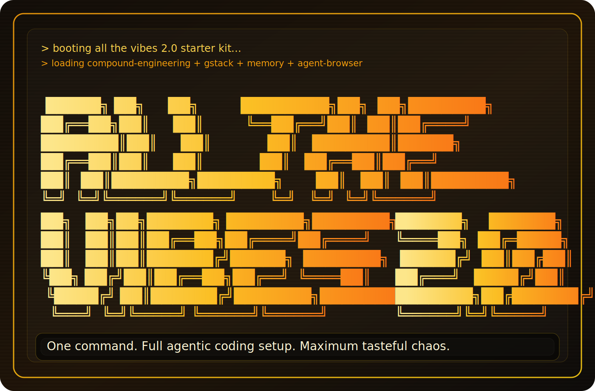

<p align="center">
       
</p>

<h1 align="center">ATV — All The Vibes 2.0 Starter Kit</h1>

<p align="center"><strong>One command. Full agentic coding setup. Maximum tasteful chaos.</strong></p>

<p align="center">
       <a href="https://www.npmjs.com/package/atv-starterkit"></a>
       <a href="https://go.dev"></a>
       <a href="https://opensource.org/licenses/MIT"></a>
       <a href="https://github.com/features/copilot"></a>
       <a href="#the-full-sprint"></a>
       <a href="#agents"></a>
</p>

<p align="center">
       <a href="#quick-start">Quick start</a> ·
       <a href="#installation">Installation</a> ·
       <a href="#uninstalling">Uninstalling</a> ·
       <a href="#the-three-pillars">Three pillars</a> ·
       <a href="#the-full-sprint">Full sprint</a> ·
       <a href="#how-learning-works">Learning</a> ·
       <a href="https://blazingbeard.github.io/quests/atv-starterkit.html">🎮 Training Quest</a> ·
       <a href="#development">Development</a>
</p>

<video src="https://github.com/user-attachments/assets/7b6bf18a-2bab-482b-a72d-fac9ab7436c2" width="100%" autoplay loop muted playsinline controls></video>

---

## What is ATV 2.0?

ATV 2.0 is a one-command installer that wires together three open-source systems into a single coherent agentic coding environment for GitHub Copilot:

- **[Compound Engineering](https://github.com/EveryInc/compound-engineering-plugin)** — planning-to-knowledge pipeline
- **[gstack](https://github.com/garrytan/gstack)** — sprint execution engine (by Garry Tan / Y Combinator)
- **[agent-browser](https://github.com/vercel-labs/agent-browser)** — browser automation layer (by Vercel)

Together they cover the full software lifecycle — from "what should I build?" through "is it healthy in production?" — with 45 skills, 29 agents, and a learning system that makes your repo smarter with every session.

---

## Quick Start

```bash
cd your-project
npx atv-starterkit@latest init           # auto-detect stack, install everything
npx atv-starterkit@latest init --guided  # interactive TUI with multi-stack selection
npx atv-starterkit@latest uninstall      # cleanly remove everything ATV installed
```

Then open **Copilot Chat** (⌃⌘I / Ctrl+Shift+I) and go:

```text
/ce-brainstorm   →  Explore the problem, produce a design doc
/ce-plan         →  Generate an implementation plan with acceptance criteria
/ce-work         →  Build against the plan with incremental commits
/ce-review       →  Multi-agent code review (security, architecture, performance)
/ce-compound     →  Document what you learned for future sessions

/lfg             →  Run the full pipeline in one shot
```

---

## Installation

### npm (recommended)

```bash
npx atv-starterkit@latest init       # quick run — downloads binary automatically
npm install -g atv-starterkit        # or global install
atv-starterkit init                  # then run from anywhere
```

The npm package downloads the correct platform binary from [GitHub Releases](https://github.com/All-The-Vibes/ATV-StarterKit/releases) — no Go toolchain needed.

### Binary (direct download)

Grab a pre-built binary from [GitHub Releases](https://github.com/All-The-Vibes/ATV-StarterKit/releases/latest) for your platform (macOS, Linux, Windows — amd64/arm64).

### From source

```bash
git clone https://github.com/All-The-Vibes/ATV-StarterKit.git
cd ATV-StarterKit && go build -o atv-installer .
```

### Prerequisites

**Required:** Git, Node.js 16+

**Optional:**
- **Bun** — for gstack browser skills (`/gstack-qa`, `/gstack-browse`, `/gstack-benchmark`)
- **GitHub PAT** — for GitHub MCP server
- **Azure CLI** — for Azure MCP server

Without Bun, text-based gstack skills still work. `agent-browser` works independently of Bun.

### Uninstalling

```bash
npx atv-starterkit@latest uninstall          # remove ATV files, preserve user-modified configs
npx atv-starterkit@latest uninstall --force  # remove everything including modified files
```

Removes `.github/skills/`, `.github/agents/`, `.github/hooks/`, `.github/copilot-*` config files, `.gstack/`, `.atv/`, and empty doc directories. Files you've customized since installation are preserved by default (checksum comparison against the install manifest). `.vscode/` is never touched.

---

## The Three Pillars

### Compound Engineering — knowledge compounds

A gated pipeline where each step produces an artifact the next step consumes:

```text
/ce-brainstorm → /ce-plan → /ce-work → /ce-review → /ce-compound
```

Every time you run `/ce-compound`, solved problems get saved to `docs/solutions/`. Next time `/ce-plan` runs, the `learnings-researcher` agent searches those files first. Your repo gets smarter with every PR.

### gstack — the AI sprint process

30 slash-command skills covering office hours, engineering review, browser QA, shipping, deploy verification, security audits, and weekly retros. gstack doesn't just give the AI more tools — it gives it a *role*. `/gstack-review` acts as a staff engineer. `/gstack-cso` acts as a chief security officer. The skills are opinionated engineering processes encoded as markdown.

Includes safety guardrails (`/gstack-careful`, `/gstack-freeze`, `/gstack-guard`) that prevent destructive commands like `rm -rf` or force-pushes.

### agent-browser — the eyes of the agent

A native Rust CLI that controls Chrome via CDP with ~100ms latency. Uses snapshot refs (`@e1`, `@e2`) for deterministic element selection — no CSS selectors or XPath needed. The `open → snapshot → interact → re-snapshot` workflow fits cleanly into an LLM's tool-calling loop.

---

## The Guided Experience

The guided installer (`--guided`) walks you through four screens:

**1. Stack Packs** — Multi-select your stacks (TypeScript, Python, Rails). Auto-detected packs are pre-selected.

**2. Preset** — Choose your depth:

| Preset | What you get |
|---|---|
| **Starter** | Core CE workflow (13 skills). No network calls, instant install. |
| **Pro** | + gstack sprint skills (35+ skills total) |
| **Full** | + browser QA, benchmarks, agent-browser, Chrome (45+ skills). Requires Bun. |

**3. Customize** — Power users can drill into category-grouped multi-select. Beginners skip straight to install.

**4. Install + Summary** — Real-time progress with structured telemetry, then actionable next steps.

```text
  ✅ Scaffolding ATV files (24 files created, 8 directories) · 340ms
  ⚠️  Syncing gstack skills — fell back to markdown-only · 2.1s
  ✅ Installing agent-browser (CLI ready, skill copied) · 1.8s

  🎉 ATV Starter Kit ready!
  Install state saved to .atv/install-manifest.json
```

---

## The Full Sprint

Every skill maps to a phase of the development lifecycle:

<table>
       <tr>
              <td width="25%" valign="top">
                     <strong>💭 Think</strong><br />
                     <sub>Frame the problem</sub><br /><br />
                     <code>/ce-brainstorm</code><br />
                     <code>/gstack-office-hours</code>
              </td>
              <td width="25%" valign="top">
                     <strong>📋 Plan</strong><br />
                     <sub>Pressure-test the approach</sub><br /><br />
                     <code>/ce-plan</code><br />
                     <code>/gstack-plan-ceo-review</code><br />
                     <code>/gstack-plan-eng-review</code><br />
                     <code>/gstack-plan-design-review</code><br />
                     <code>/gstack-autoplan</code>
              </td>
              <td width="25%" valign="top">
                     <strong>🔨 Build</strong><br />
                     <sub>Execute with momentum</sub><br /><br />
                     <code>/ce-work</code><br />
                     <code>/lfg</code><br />
                     <code>/slfg</code>
              </td>
              <td width="25%" valign="top">
                     <strong>👀 Review</strong><br />
                     <sub>Find what you missed</sub><br /><br />
                     <code>/ce-review</code><br />
                     <code>/gstack-review</code><br />
                     <code>/gstack-cso</code><br />
                     <code>/gstack-codex</code>
              </td>
       </tr>
       <tr>
              <td width="33.33%" valign="top">
                     <strong>🧪 Test</strong><br />
                     <sub>Use real browser eyes</sub><br /><br />
                     <code>agent-browser</code><br />
                     <code>/gstack-qa</code><br />
                     <code>/gstack-benchmark</code><br />
                     <code>/gstack-browse</code>
              </td>
              <td width="33.33%" valign="top">
                     <strong>🚀 Ship</strong><br />
                     <sub>Land without chaos</sub><br /><br />
                     <code>/gstack-ship</code><br />
                     <code>/gstack-land-and-deploy</code><br />
                     <code>/gstack-canary</code><br />
                     <code>/gstack-document-release</code>
              </td>
              <td width="33.33%" valign="top">
                     <strong>📊 Reflect</strong><br />
                     <sub>Compound what you learned</sub><br /><br />
                     <code>/ce-compound</code><br />
                     <code>/learn</code><br />
                     <code>/evolve</code><br />
                     <code>/unslop</code><br />
                     <code>/gstack-retro</code>
              </td>
       </tr>
</table>

### `/lfg` — full pipeline, one command

Each step must produce output before the next starts (plan file exists, plan was deepened, code was changed). Retries on failure.

```
plan → deepen → work → review → unslop → resolve → test → video → compound
  ✓       ✓       ✓
```

### `/slfg` — parallel swarm variant

Same steps. Planning is sequential, review + test + unslop run in parallel.

```
plan → deepen → work (swarm) ──→ review    ⎤              resolve → unslop fix → video → compound
                                  test     ⎥ (parallel) →
                                  unslop   ⎦
```

`unslop fix` removes AI slop after review. `compound` saves learnings for future `ce-plan` runs.

<details>
<summary><strong>Full skill reference (45 skills)</strong></summary>

### Think

| Skill | What it does |
|---|---|
| `/ce-brainstorm` | Interactive dialogue to clarify requirements; produces design docs in `docs/brainstorms/` |
| `/gstack-office-hours` | YC-style forcing questions that challenge your framing before you write code |
| `/gstack-plan-ceo-review` | CEO-level review: find the 10-star product hiding in the request |

### Plan

| Skill | What it does |
|---|---|
| `/ce-plan` | Parallel research agents scan codebase + external docs; auto-discovers brainstorms; outputs plans with acceptance criteria |
| `/deepen-plan` | Enriches each plan section with best practices and performance guidance |
| `/gstack-plan-eng-review` | Forces hidden assumptions into the open: architecture, data flow, edge cases |
| `/gstack-plan-design-review` | Scores design quality 0-10 per dimension; rewrites plan to hit 10 |
| `/gstack-autoplan` | Runs CEO → design → eng review in one command |

### Build

| Skill | What it does |
|---|---|
| `/ce-work` | Implements against the plan with incremental commits and system-wide sanity checks |
| `/lfg` | Full pipeline: plan → deepen → work → review → test → video → compound |
| `/slfg` | Parallelized version via swarm agents |

### Review

| Skill | What it does |
|---|---|
| `/ce-review` | Parallel review agents: security, performance, architecture, language-specific |
| `/gstack-review` | Staff-level code review with auto-fix and completeness checks |
| `/gstack-design-review` | Design audit with atomic fix commits |
| `/gstack-cso` | OWASP Top 10 + STRIDE threat model |
| `/gstack-codex` | Cross-model review via OpenAI Codex CLI |

### Test

| Skill | What it does |
|---|---|
| `agent-browser` | Direct browser automation: open, snapshot, click, fill, screenshot, inspect |
| `/gstack-qa` | Full QA loop: find bugs in real browser, fix them, write regressions, re-verify |
| `/gstack-qa-only` | Report-only QA (no fixes) |
| `/gstack-benchmark` | Page load baselines, Core Web Vitals, resource sizes |
| `/gstack-browse` | Persistent browser runtime for deeper sessions |

### Ship

| Skill | What it does |
|---|---|
| `/gstack-ship` | Sync main, run tests, audit coverage, push, open PR |
| `/gstack-land-and-deploy` | Merge → CI → deploy → verify production |
| `/gstack-canary` | Post-deploy monitoring for errors and regressions |
| `/gstack-document-release` | Auto-update project docs to match what shipped |

### Reflect

| Skill | What it does |
|---|---|
| `/ce-compound` | Documents solved problems in `docs/solutions/` for future sessions |
| `/learn` | Extracts coding patterns from recent work into instincts with confidence scoring |
| `/instincts` | Dashboard showing all learned patterns grouped by domain |
| `/evolve` | Promotes mature instincts (confidence >0.8) into permanent Copilot skills |
| `/observe` | Focused pattern analysis on a specific domain or file pattern |
| `/unslop` | De-slop pass: code simplification + comment rot + design slop detection |
| `/gstack-retro` | Team-aware weekly retro with per-person breakdowns |
| `/gstack-learn` | Per-project self-learning infrastructure |

### Safety Guardrails

| Skill | What it does |
|---|---|
| `/gstack-careful` | Warns before `rm -rf`, `DROP TABLE`, force-push |
| `/gstack-freeze` | Restricts edits to one directory while debugging |
| `/gstack-guard` | Careful + Freeze combined |
| `/gstack-investigate` | No fixes without systematic investigation first |

</details>

---

## How Learning Works

Most AI coding tools treat every session as day one. ATV remembers.

Every time you start a Copilot session, the AI has no memory of how *your team* writes code — that you wrap errors with `%w`, prefer table-driven tests, or use constructor injection. ATV fixes this with a **continuous learning pipeline** that observes how you code, extracts reusable patterns, and graduates proven ones into permanent Copilot skills.

### The Loop

```text
You code normally
     ↓
Observer hooks silently capture tool use → .atv/observations.jsonl
     ↓
/learn analyzes observations + git history → instincts with confidence scores
     ↓
Confidence grows with each session (0.5 → 0.6 → 0.7 → 0.8)
     ↓
/evolve promotes mature instincts → .github/skills/learned-*/SKILL.md
     ↓
Next session: Copilot already knows your patterns
```

### Observer Hooks

ATV installs hooks for all 6 Copilot lifecycle events (`sessionStart`, `sessionEnd`, `preToolUse`, `postToolUse`, `userPromptSubmitted`, `errorOccurred`). A lightweight Node.js script captures every tool interaction to `.atv/observations.jsonl` — silently, with zero impact on your workflow.

### Instincts

`/learn` analyzes git history, diffs, observations, and existing solutions to find recurring patterns. Each becomes an "instinct" with a confidence score:

```yaml
# .atv/instincts/project.yaml
instincts:
  - id: always-wrap-errors
    trigger: "when returning an error from a function"
    behavior: "wrap with fmt.Errorf using %w"
    confidence: 0.85
    observations: 12
```

Run `/instincts` to see the dashboard:

```text
  Error Handling (2 instincts)
    ★ always-wrap-errors        0.9  "wrap errors with fmt.Errorf %w"    15 obs
    ● sentinel-errors           0.6  "use sentinel errors for expected"   5 obs

  Testing (1 instinct)
    ★ table-driven-tests        0.85 "use table-driven test pattern"     12 obs

  Legend: ★ ready to evolve (>0.8)  ● active  ○ tentative (<0.5)
```

When an instinct reaches >0.8 confidence, `/evolve` promotes it into a full SKILL.md at `.github/skills/learned-*/`. Copilot auto-discovers these — your AI assistant now *permanently knows* your team's conventions.

### Design Decisions

- **Instincts are committed to git** — the whole team benefits, not just one developer
- **Observations are gitignored** — raw data is ephemeral, instincts are permanent
- **Generated skills use `learned-` prefix** — visually distinct from hand-written skills
- **Confidence scoring prevents noise** — only well-established patterns get promoted

---

## De-Slop

AI coding assistants have a tell: over-abstraction, `// This function handles the logic for...` comments, purple-to-blue gradients. Code review catches bugs — but nobody catches *slop*.

`/unslop` runs three parallel analysis passes on your recent changes:

```text
/unslop                          →  Report slop in changed files
/unslop src/components/          →  Scope to a directory
/unslop fix                      →  Auto-apply safe fixes
```

| Pass | What it catches | Example |
|------|----------------|---------|
| **Code Slop** | Over-abstraction, YAGNI violations, nested ternaries | Interface used once → inline it |
| **Comment Rot** | Obvious restatements, AI filler phrases, stale TODOs | `// This function handles auth` → delete |
| **Design Slop** | Generic gradients, template layouts, missing hover states | Purple-to-blue default → use brand palette |

`/unslop` is wired into both autonomous pipelines — `/lfg` runs `/unslop fix` after review, and `/slfg` runs the report pass in parallel with `ce-review` and browser testing for zero added wall-clock time.

`/ce-review` asks "is this correct?" — `/unslop` asks "does this look human-written?" Run both.

---

## Memory Architecture

ATV builds seven layers of memory across three reinforcing cycles:

| Layer | Where | Timescale |
|---|---|---|
| **Observations** | `.atv/observations.jsonl` | Per-session (gitignored) |
| **Instincts** | `.atv/instincts/project.yaml` | Grows every session |
| **Evolved skills** | `.github/skills/learned-*/` | Permanent |
| **Institutional knowledge** | `docs/solutions/*.md` | Permanent |
| **Design decisions** | `docs/brainstorms/*.md` | Permanent |
| **Implementation plans** | `docs/plans/*.md` | Per-feature |
| **Install manifest** | `.atv/install-manifest.json` | Per-install |

**How they reinforce each other:**

- **Knowledge compounding** (per-PR): `/ce-compound` saves solved problems → future `/ce-plan` finds them via `learnings-researcher` → fewer repeated mistakes
- **Pattern learning** (per-session): observer hooks → `/learn` → instincts → `/evolve` → permanent skills → Copilot knows your conventions
- **Team propagation** (per-commit): instincts are committed to git → the whole team inherits learned patterns without a style guide

Over weeks, your repo develops a memory that makes every Copilot session more effective than the last.

---

## Agents

29 specialized agents in `.github/agents/`, invoked by skills during review, planning, learning, and debugging:

| Category | Agents |
|---|---|
| **Code Review** | `kieran-rails-reviewer`, `kieran-python-reviewer`, `kieran-typescript-reviewer`, `dhh-rails-reviewer`, `code-simplicity-reviewer`, `julik-frontend-races-reviewer` |
| **Security** | `security-sentinel` |
| **Architecture** | `architecture-strategist` |
| **Performance** | `performance-oracle` |
| **Data** | `data-integrity-guardian`, `data-migration-expert`, `schema-drift-detector`, `deployment-verification-agent` |
| **Design** | `design-implementation-reviewer`, `design-iterator`, `figma-design-sync` |
| **Research** | `repo-research-analyst`, `best-practices-researcher`, `framework-docs-researcher`, `learnings-researcher`, `git-history-analyzer` |
| **Process** | `pr-comment-resolver`, `spec-flow-analyzer`, `bug-reproduction-validator`, `pattern-recognition-specialist` |
| **Learning** | `pattern-observer` |
| **Meta** | `agent-native-reviewer`, `ankane-readme-writer` |
| **Ops** | `lint` |

---

## What Gets Installed

### Copilot Integration Points

| File | Purpose |
|---|---|
| `.github/copilot-instructions.md` | System instructions loaded into every chat |
| `.github/copilot-setup-steps.yml` | Coding Agent initialization steps |
| `.github/copilot-mcp-config.json` | MCP server configuration |
| `.github/skills/*/SKILL.md` | Skills auto-discovered by description match |
| `.github/agents/*.agent.md` | Agents for subagent orchestration |
| `.github/*.instructions.md` | File-scoped instructions via `applyTo` globs |
| `.github/hooks/copilot-hooks.json` | Observer hooks (silent, every tool use) |

### Supported Stacks

| Stack | Detection | Additions |
|---|---|---|
| **TypeScript** | `tsconfig.json` | TypeScript reviewer, TS file instructions |
| **Python** | `pyproject.toml` / `requirements.txt` | Python reviewer, Python file instructions |
| **Rails** | `Gemfile` + `config/routes.rb` | 8 Rails-specific agents, Ruby file instructions |
| **General** | fallback | Universal agents and skills |

### MCP Servers

| Server | Type | Package |
|---|---|---|
| **Context7** | SSE | `mcp.context7.com` |
| **GitHub** | stdio | `@modelcontextprotocol/server-github` |
| **Azure** | stdio | `@azure/mcp` |
| **Terraform** | stdio | `terraform-mcp-server` |

---

## How It Works Under the Hood

```text
atv-installer init --guided
        │
        ▼
 Detect stack + prerequisites (git, bun, node)
        │
        ▼
 Stack Packs → Preset → Customize?
        │
        ▼
 Install with structured telemetry:
        │
        ├── ATV scaffold ──► Embedded templates → .github/skills/*/SKILL.md
        │
        ├── Learning pipeline ──► Observer hooks + skills + instinct storage
        │
        ├── gstack ──► git clone → .gstack/ (staging, gitignored)
        │               └── Copy SKILL.md → .github/skills/gstack-*/
        │
        └── agent-browser ──► npm install -g → agent-browser install (Chrome)
                              └── .github/skills/agent-browser/SKILL.md
        │
        ▼
 Write manifest to .atv/install-manifest.json
```

All templates are embedded at compile time — no runtime network calls for the core scaffold. gstack requires a network clone (~22MB). Re-running is idempotent: existing files are skipped, JSON configs are merged.

---

## Development

```bash
go build -o atv-installer .             # build
go test ./...                            # all tests
go test ./pkg/installstate/ -v           # manifest + recommendations tests
go test ./pkg/monitor/ -v                # watcher + drift detection tests
go test ./test/sandbox/ -v               # integration tests (E2E scenarios)
```

## Limitations

- **Bun required for browser skills** — `/gstack-qa`, `/gstack-browse`, `/gstack-benchmark`
- **Network required for gstack** — clones ~22MB at install time
- **gstack setup on Windows** — falls back to `bun run gen:skill-docs` (bash path issues)
- **Token-heavy pipelines** — long multi-agent sessions can hit context limits

---

<div align="center">

MIT — Built by [All The Vibes](https://github.com/All-The-Vibes)

Powered by [Compound Engineering](https://github.com/EveryInc/compound-engineering-plugin) · [gstack](https://github.com/garrytan/gstack) · [agent-browser](https://github.com/vercel-labs/agent-browser)

Special thanks to [blazingbeard](https://github.com/blazingbeard) for building out the [guided training quest](https://blazingbeard.github.io/quests/atv-starterkit.html).

</div>
