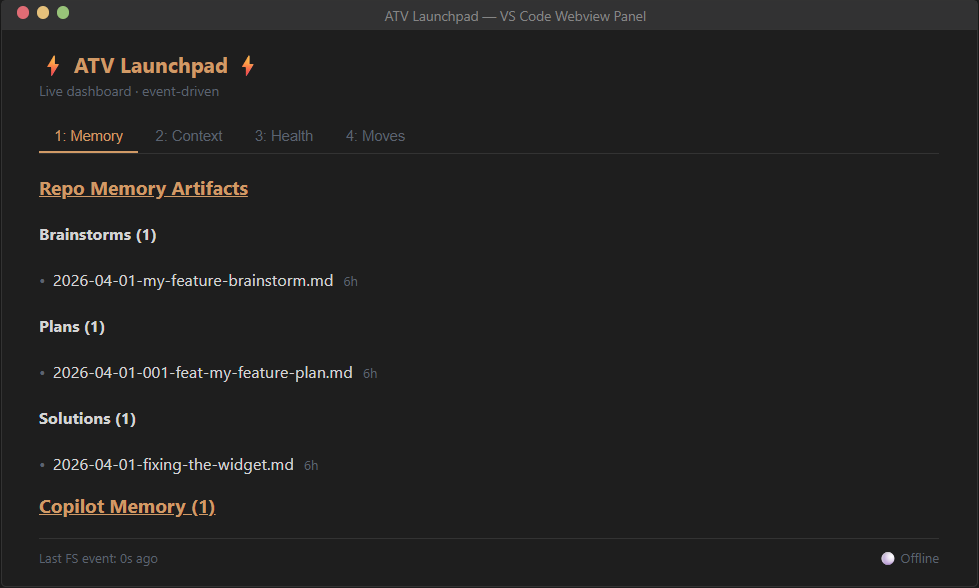
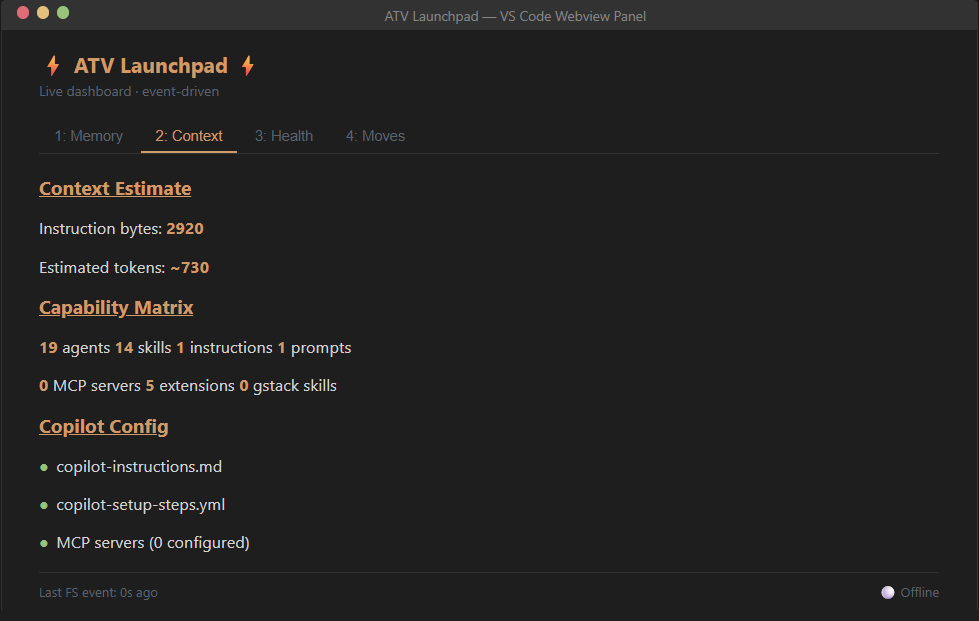
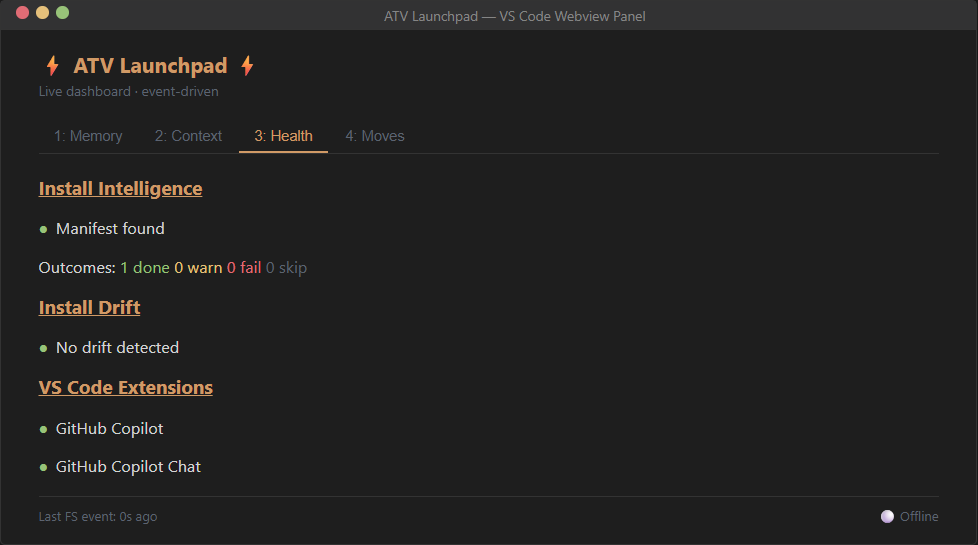
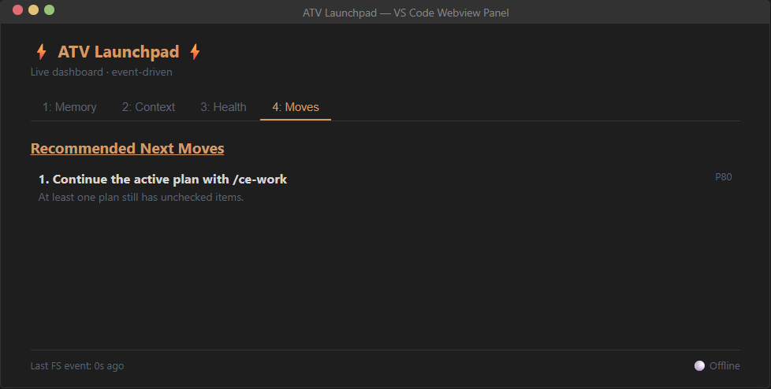

<p align="center">
       
</p>

<h1 align="center">ATV — All The Vibes 2.0 Starter Kit</h1>

<p align="center"><strong>One command. Full agentic coding setup. Maximum tasteful chaos.</strong></p>

<p align="center">
       <a href="https://www.npmjs.com/package/atv-starterkit"></a>
       <a href="https://go.dev"></a>
       <a href="https://opensource.org/licenses/MIT"></a>
       <a href="https://github.com/features/copilot"></a>
       <a href="#the-full-sprint"></a>
       <a href="#the-agent-roster"></a>
</p>

<p align="center">
       <a href="#quick-start">Quick start</a> ·
       <a href="#the-launchpad">Launchpad</a> ·
       <a href="#installation">Installation</a> ·
       <a href="#the-three-pillars">Three pillars</a> ·
       <a href="#the-full-sprint">Full sprint</a> ·
       <a href="#development">Development</a>
</p>

---

## What is ATV 2.0?

ATV 2.0 is a one-command installer that wires together three open-source systems into a single coherent agentic coding environment for GitHub Copilot:

- **Compound Engineering** — the planning-to-knowledge pipeline
- **gstack** — the sprint execution engine
- **agent-browser** — the browser automation layer

Together they cover the full software lifecycle — from "what should I build?" through "is it healthy in production?" — with 45 skills, 28 agents, a memory-aware launchpad, and a knowledge system that makes your repo smarter with every PR.

---

## Quick Start

### 1. Install

```bash
cd your-project
npx atv-starterkit@latest init
```

Auto-detects your stack. Installs 13 core skills, 29 agents, MCP servers, and docs structure. Done in seconds.

For the interactive TUI with multi-stack selection:

```bash
npx atv-starterkit@latest init --guided
```

**What `init` does:**

```
  ⚡ All The Vibes 2.0 ⚡
  One command. Full agentic coding setup.

  Auto-detected primary: typescript project (tsconfig.json found, existing git repo)
  Likely stack packs: TypeScript

  📁 .github/skills
  📁 .github/agents
  📁 .vscode
  📁 docs/plans
  📁 docs/brainstorms
  📁 docs/solutions
  ✅ .github/copilot-instructions.md
  ✅ .github/copilot-setup-steps.yml
  ✅ .github/copilot-mcp-config.json
  ✅ .github/skills/ce-brainstorm/SKILL.md
  ✅ .github/skills/ce-plan/SKILL.md
  ✅ .github/skills/ce-work/SKILL.md
  ✅ .github/skills/ce-review/SKILL.md
  ✅ .github/skills/ce-compound/SKILL.md
  ...
```

### 2. Use

Open **Copilot Chat** in VS Code (⌃⌘I / Ctrl+Shift+I) and run skills as slash commands:

```text
/ce-brainstorm   →  Explore the problem, produce a design doc
/ce-plan         →  Generate an implementation plan with acceptance criteria
/ce-work         →  Build against the plan with incremental commits
/ce-review       →  Multi-agent code review (security, architecture, performance)
/ce-compound     →  Document what you learned for future sessions
```

Or run the full pipeline in one shot:

```text
/lfg             →  Plan → deepen → build → review → test → compound
```

### 3. Open the Launchpad

```bash
npx atv-starterkit launchpad
```

Shows your live memory dashboard with install intelligence and next-step recommendations. Reopenable any time — no reinstall needed.

---

## The Launchpad

The launchpad is available in two forms: a **live terminal TUI** and a **VS Code webview extension**. Both show the same four signal-oriented tabs and update in real time when your files change.

### Terminal TUI

Run `npx atv-starterkit launchpad` for the interactive terminal dashboard. Arrow keys or `1`-`4` to switch tabs, `r` to refresh, `q` to quit.

<details>
<summary><strong>Tab 1: Memory</strong> — repo memory artifacts with timestamps</summary>

```
  ⚡ ATV Launchpad ⚡  Live dashboard · event-driven

  [ 1:Memory ]│  2:Context  │  3:Health  │  4:Moves  

  Repo Memory Artifacts

  Brainstorms (1)
    • 2026-04-01-my-feature-brainstorm.md  12m ago

  Plans (1)
    • 2026-04-01-001-feat-my-feature-plan.md  12m ago

  Solutions (1)
    • 2026-04-01-fixing-the-widget.md  12m ago

  Copilot Memory Files (1)
    • project-patterns.md

  ⚠ Active plan has unchecked work

  Last FS event: 2s ago  │  ← → tab  1-4 jump  j/k navigate  r refresh  q quit
```
</details>

<details>
<summary><strong>Tab 2: Context</strong> — instruction budget and capability matrix</summary>

```
  ⚡ ATV Launchpad ⚡  Live dashboard · event-driven

   1:Memory  │[ 2:Context ]│  3:Health  │  4:Moves  

  Context Estimate

  Instruction bytes  24680
  Estimated tokens   ~6170

  Capability Matrix

  19 agents   14 skills   1 instructions   1 prompts
  0 MCP servers   5 extensions   0 gstack skills

  Copilot Config

  ● copilot-instructions.md
  ● copilot-setup-steps.yml
  ● MCP servers (0 configured)
  ○ compound-engineering.local.md

  Last FS event: 1s ago  │  ← → tab  1-4 jump  j/k navigate  r refresh  q quit
```
</details>

<details>
<summary><strong>Tab 3: Health</strong> — install drift detection and runtime status</summary>

```
  ⚡ ATV Launchpad ⚡  Live dashboard · event-driven

   1:Memory  │  2:Context  │[ 3:Health ]│  4:Moves  

  Install Intelligence

  ● Manifest    .atv/install-manifest.json
  │ Last run    2026-04-02 15:58 UTC
  │ Preset      Starter
  │ Stacks      General, TypeScript
  ╰ Outcomes    1 done  0 warn  0 fail  0 skip

  Install Drift

  ✓ No drift detected

  Runtime

  ○ gstack staging
  ○ gstack runtime
  ○ agent-browser skill
  ● ~/.gstack/ user config
  ○ ~/.agent-browser/ sessions

  Last FS event: 5s ago  │  ← → tab  1-4 jump  j/k navigate  r refresh  q quit
```

When files have been modified or deleted since install, drift is shown:

```
  Install Drift

  ⚠ .github/copilot-instructions.md  user-modified
  ✗ .github/copilot-setup-steps.yml  missing
```
</details>

<details>
<summary><strong>Tab 4: Moves</strong> — prioritized next-step recommendations</summary>

```
  ⚡ ATV Launchpad ⚡  Live dashboard · event-driven

   1:Memory  │  2:Context  │  3:Health  │[ 4:Moves ]

  Recommended Next Moves

  ▸ 1. Continue the active plan with /ce-work       [Enter to run]
    At least one plan still has unchecked items.

    2. Create prompt files for repeatable workflows
    No .prompt.md files found in .github/prompts/.

    3. Add compound-engineering.local.md
    Configure CE review agents for structured code review.

  Last FS event: 3s ago  │  ← → tab  1-4 jump  j/k navigate  r refresh  q quit
```

Select a recommendation and press Enter to see the confirm dialog:

```
  Confirm Action

  ▸ Reinitialize ATV files to restore drifted config
  Command: atv-installer init
  Risk:    safe

  Enter to approve   Esc to cancel
```
</details>

For non-interactive contexts (piped output, CI, VS Code Copilot Chat), use `--static` for a one-shot printable view:

```bash
npx atv-starterkit launchpad --static
```

### VS Code Webview Extension

The `vscode-atv-launchpad/` extension provides the same 4-tab dashboard as a VS Code webview panel. It watches `.atv/launchpad-state.json` for live updates from the filesystem watcher and detects active VS Code extensions (GitHub Copilot, Copilot Chat).

| Memory | Context |
|:---:|:---:|
|  |  |

| Health | Moves |
|:---:|:---:|
|  |  |

**Tab descriptions:**

| Tab | What it shows |
|---|---|
| **Memory** | Brainstorms, plans, solutions, and Copilot memory files with relative timestamps |
| **Context** | Instruction byte count, estimated tokens, capability matrix (agents/skills/instructions/prompts/MCP/extensions), Copilot config status |
| **Health** | Install manifest status, outcome summary, install drift detection (modified/missing files), VS Code extension status |
| **Moves** | Priority-scored recommendations based on local repo state analysis |

---

## Installation

### npm (recommended)

```bash
npx atv-starterkit@latest init       # quick run — downloads binary automatically
npm install -g atv-starterkit        # global install
atv-starterkit init                  # then run from anywhere
```

The npm package downloads the correct platform binary from [GitHub Releases](https://github.com/All-The-Vibes/ATV-StarterKit/releases) during install — no Go toolchain needed.

### Binary (direct download)

Grab a pre-built binary from [GitHub Releases](https://github.com/All-The-Vibes/ATV-StarterKit/releases/latest) for your platform (macOS, Linux, Windows — amd64/arm64).

### From source

```bash
git clone https://github.com/All-The-Vibes/ATV-StarterKit.git
cd ATV-StarterKit && go build -o atv-installer .
```

### Prerequisites

**Required:** Git, Node.js 16+

**Optional:**
- **Bun** — for gstack browser skills (`/gstack-qa`, `/gstack-browse`, `/gstack-benchmark`)
- **GitHub PAT** — for GitHub MCP server
- **Azure CLI** — for Azure MCP server

Without Bun, text-based gstack skills still work. `agent-browser` works independently of Bun.

---

## The Guided Experience

The guided installer (`--guided`) walks you through:

### Screen 1: Stack Packs

```text
┃ Which stack packs should be included?
┃ [✓] General
┃ [✓] TypeScript    (tsconfig.json detected)
┃ [ ] Python
┃ [ ] Rails
```

Multi-select — auto-detected packs are pre-selected. Stack packs are additive.

### Screen 2: Preset

```text
┃ Choose your setup level
┃
┃ > ⚡ Starter — Core workflow (13 skills, instant)
┃     Plan, build, review, compound. No browser tools.
┃
┃   🚀 Pro — Full sprint process (35+ skills)
┃     + gstack review, ship, safety, security, debugging
┃
┃   🔥 Full — Complete engineering team (45+ skills)
┃     + browser QA, benchmarks, agent-browser, Chrome
┃     Requires: Bun, ~2min install
```

**Starter** is pure Compound Engineering — no network calls, instant install. **Pro** adds gstack sprint skills. **Full** is everything: all 45 skills, gstack browser runtime, agent-browser CLI, and Chrome for Testing.

### Screen 3: Customize?

Power users can drill into category-grouped multi-select. Beginners skip straight to install.

### Screen 4: Install Progress

```text
  Installing Pro preset for typescript...

  ✅ Scaffolding ATV files (24 files created, 8 directories) · 340ms
  ⚠️  Syncing gstack skills — setup failed, fell back to docs · 2.1s
  ✅ Installing agent-browser (CLI ready, skill copied) · 1.8s
```

Real-time animated spinners with structured telemetry: durations, skip reasons, substep events.

### Screen 5: Summary + Recommendations

```text
  Guided install summary

  ✅ Scaffolding ATV files (24 files created) · 340ms
  ⚠️  Syncing gstack skills — fell back to markdown-only · 2.1s
  ✅ Installing agent-browser (CLI ready, skill copied) · 1.8s

  Recommended next moves

    1. Fix installer warnings before relying on every capability
    2. Start with /ce-brainstorm to shape the first feature

  🎉 ATV Starter Kit ready!
  Install state saved to .atv/install-manifest.json
  Reopen later with: npx atv-starterkit launchpad
```

---

## The Three Pillars

### Compound Engineering — knowledge compounds

**Origin:** [compound-engineering](https://github.com/EveryInc/compound-engineering-plugin) by Every

A gated pipeline where each step produces an artifact the next step consumes:

- `/ce-brainstorm` → `/ce-plan` → `/ce-work` → `/ce-review` → `/ce-compound`
- `docs/solutions/` — structured solution docs, searchable by the `learnings-researcher` agent during future planning
- `docs/plans/` and `docs/brainstorms/` — living documents that track decisions, not just code

**The key insight:** Every time you run `/ce-compound`, solved problems get saved to `docs/solutions/`. Next time `/ce-plan` runs, the `learnings-researcher` agent searches those files first. Your repo gets smarter with every PR.

### gstack — the AI sprint process

**Origin:** [gstack](https://github.com/garrytan/gstack) by Garry Tan (Y Combinator)

- 30 slash-command skills covering office hours, engineering review, browser QA, shipping, deploy verification, security audits, safety guardrails, and weekly retros
- A real Chromium browser the agent controls with sub-second commands and cookie state
- Safety guardrails (`/gstack-careful`, `/gstack-freeze`, `/gstack-guard`) that prevent destructive commands

**The key insight:** gstack doesn't just give the AI more tools — it gives the AI a *role*. `/gstack-review` acts as a staff engineer. `/gstack-cso` acts as a chief security officer. The skills are opinionated engineering processes encoded as markdown.

### agent-browser — the eyes of the agent

**Origin:** [agent-browser](https://github.com/vercel-labs/agent-browser) by Vercel

- A native Rust CLI that controls Chrome via CDP with ~100ms latency per command
- Snapshot refs (`@e1`, `@e2`) — deterministic element selection for AI tool-calling loops
- Sessions, profiles, authentication vault, cookie persistence

**The key insight:** The snapshot-ref workflow (`open → snapshot → interact → re-snapshot`) fits cleanly into an LLM's tool-calling loop. No CSS selectors or XPath needed.

---

## Why Memory Matters

| Layer | What remembers | Where it lives | Who reads it |
|---|---|---|---|
| **Institutional knowledge** | Solved problems, gotchas, patterns | `docs/solutions/*.md` | `learnings-researcher` agent during `/ce-plan` and `/ce-review` |
| **Design decisions** | Why we chose approach A over B | `docs/brainstorms/*.md` | `/ce-plan` auto-discovers recent brainstorms |
| **Implementation plans** | What to build, acceptance criteria | `docs/plans/*.md` | `/ce-work` reads and checks off items |
| **Install manifest** | What the installer intended, attempted, skipped, failed | `.atv/install-manifest.json` | `npx atv-starterkit launchpad` |
| **Project config** | Which review agents to run | `compound-engineering.local.md` | `/ce-review`, `/ce-work` |
| **gstack session state** | Active sessions, preferences | `~/.gstack/` | Every gstack skill |
| **Browser state** | Cookies, localStorage, login sessions | `~/.agent-browser/sessions/` | `agent-browser` |

The compound engineering memory loop:

```text
solve problem → /ce-compound documents it → docs/solutions/
                                                    ↓
future /ce-plan → learnings-researcher searches docs/solutions/ → avoids past mistakes
```

---

## The Full Sprint

<table>
       <tr>
              <td width="25%" valign="top">
                     <strong>💭 Think</strong><br />
                     <sub>Frame the problem</sub><br /><br />
                     <code>/ce-brainstorm</code><br />
                     <code>/gstack-office-hours</code>
              </td>
              <td width="25%" valign="top">
                     <strong>📋 Plan</strong><br />
                     <sub>Pressure-test the approach</sub><br /><br />
                     <code>/ce-plan</code><br />
                     <code>/gstack-plan-ceo-review</code><br />
                     <code>/gstack-plan-eng-review</code><br />
                     <code>/gstack-plan-design-review</code><br />
                     <code>/gstack-autoplan</code>
              </td>
              <td width="25%" valign="top">
                     <strong>🔨 Build</strong><br />
                     <sub>Execute with momentum</sub><br /><br />
                     <code>/ce-work</code><br />
                     <code>/lfg</code><br />
                     <code>/slfg</code>
              </td>
              <td width="25%" valign="top">
                     <strong>👀 Review</strong><br />
                     <sub>Find what you missed</sub><br /><br />
                     <code>/ce-review</code><br />
                     <code>/gstack-review</code><br />
                     <code>/gstack-design-review</code><br />
                     <code>/gstack-cso</code><br />
                     <code>/gstack-codex</code>
              </td>
       </tr>
       <tr>
              <td width="33.33%" valign="top">
                     <strong>🧪 Test</strong><br />
                     <sub>Use real browser eyes</sub><br /><br />
                     <code>agent-browser</code><br />
                     <code>/gstack-qa</code><br />
                     <code>/gstack-qa-only</code><br />
                     <code>/gstack-benchmark</code><br />
                     <code>/gstack-browse</code>
              </td>
              <td width="33.33%" valign="top">
                     <strong>🚀 Ship</strong><br />
                     <sub>Land without chaos</sub><br /><br />
                     <code>/gstack-ship</code><br />
                     <code>/gstack-land-and-deploy</code><br />
                     <code>/gstack-canary</code><br />
                     <code>/gstack-document-release</code>
              </td>
              <td width="33.33%" valign="top">
                     <strong>📊 Reflect</strong><br />
                     <sub>Compound what you learned</sub><br /><br />
                     <code>/ce-compound</code><br />
                     <code>/gstack-retro</code><br />
                     <code>/gstack-learn</code>
              </td>
       </tr>
</table>

> 🛡️ Safety guardrails apply across the whole sprint: `/gstack-careful`, `/gstack-freeze`, `/gstack-guard`, and `/gstack-investigate`.

<details>
<summary><strong>Skill reference by phase</strong></summary>

### Think

| Skill | What it does |
|---|---|
| `/ce-brainstorm` | Interactive dialogue to clarify requirements; produces design docs in `docs/brainstorms/` |
| `/gstack-office-hours` | YC-style forcing questions that challenge your framing before you write code |
| `/gstack-plan-ceo-review` | CEO-level review: find the 10-star product hiding in the request |

### Plan

| Skill | What it does |
|---|---|
| `/ce-plan` | Parallel research agents scan codebase + external docs; auto-discovers brainstorms; outputs plans with acceptance criteria |
| `/deepen-plan` | Enriches each plan section with best practices and performance guidance |
| `/gstack-plan-eng-review` | Forces hidden assumptions into the open: architecture, data flow, edge cases |
| `/gstack-plan-design-review` | Scores design quality 0-10 per dimension; rewrites plan to hit 10 |
| `/gstack-autoplan` | Runs CEO → design → eng review in one command |

### Build

| Skill | What it does |
|---|---|
| `/ce-work` | Implements against the plan with incremental commits and system-wide sanity checks |
| `/lfg` | Full pipeline: plan → deepen → work → review → test → video → compound |
| `/slfg` | Parallelized version via swarm agents |

### Review

| Skill | What it does |
|---|---|
| `/ce-review` | Parallel review agents: security, performance, architecture, language-specific |
| `/gstack-review` | Staff-level code review with auto-fix and completeness checks |
| `/gstack-design-review` | Design audit with atomic fix commits |
| `/gstack-cso` | OWASP Top 10 + STRIDE threat model |
| `/gstack-codex` | Cross-model review via OpenAI Codex CLI |

### Test

| Skill | What it does |
|---|---|
| `agent-browser` | Direct browser automation: open, snapshot, click, fill, screenshot, inspect |
| `/gstack-qa` | Full QA loop: find bugs in real browser, fix them, write regressions, re-verify |
| `/gstack-qa-only` | Report-only QA |
| `/gstack-benchmark` | Page load baselines, Core Web Vitals, resource sizes |
| `/gstack-browse` | Persistent browser runtime for deeper sessions |

### Ship

| Skill | What it does |
|---|---|
| `/gstack-ship` | Sync main, run tests, audit coverage, push, open PR |
| `/gstack-land-and-deploy` | Merge → CI → deploy → verify production |
| `/gstack-canary` | Post-deploy monitoring for errors and regressions |
| `/gstack-document-release` | Auto-update project docs to match what shipped |

### Reflect

| Skill | What it does |
|---|---|
| `/ce-compound` | Documents solved problems in `docs/solutions/` — compounds knowledge for future sessions |
| `/gstack-retro` | Team-aware weekly retro with per-person breakdowns |
| `/gstack-learn` | Per-project self-learning infrastructure |

### Safety Guardrails

| Skill | What it does |
|---|---|
| `/gstack-careful` | Warns before `rm -rf`, `DROP TABLE`, force-push |
| `/gstack-freeze` | Restricts edits to one directory while debugging |
| `/gstack-guard` | Careful + Freeze combined |
| `/gstack-investigate` | No fixes without systematic investigation first |

</details>

---

## The Agent Roster

28 specialized agents in `.github/agents/`, invoked by skills during review, planning, and debugging:

| Category | Agents |
|---|---|
| **Code Review** | `kieran-rails-reviewer`, `kieran-python-reviewer`, `kieran-typescript-reviewer`, `dhh-rails-reviewer`, `code-simplicity-reviewer`, `julik-frontend-races-reviewer` |
| **Security** | `security-sentinel` |
| **Architecture** | `architecture-strategist` |
| **Performance** | `performance-oracle` |
| **Data** | `data-integrity-guardian`, `data-migration-expert`, `schema-drift-detector`, `deployment-verification-agent` |
| **Design** | `design-implementation-reviewer`, `design-iterator`, `figma-design-sync` |
| **Research** | `repo-research-analyst`, `best-practices-researcher`, `framework-docs-researcher`, `learnings-researcher`, `git-history-analyzer` |
| **Process** | `pr-comment-resolver`, `spec-flow-analyzer`, `bug-reproduction-validator`, `pattern-recognition-specialist` |
| **Meta** | `agent-native-reviewer`, `ankane-readme-writer` |
| **Ops** | `lint` |

---

## What Gets Installed

### All 6 Copilot Lifecycle Hooks

| # | Hook | File | When it fires |
|---|---|---|---|
| 1 | **System Instructions** | `.github/copilot-instructions.md` | Every Copilot chat |
| 2 | **Setup Steps** | `.github/copilot-setup-steps.yml` | Coding Agent initialization |
| 3 | **MCP Servers** | `.github/copilot-mcp-config.json` | Copilot startup |
| 4 | **Skills** | `.github/skills/*/SKILL.md` | When description matches request |
| 5 | **Agents** | `.github/agents/*.agent.md` | Subagent orchestration |
| 6 | **File Instructions** | `.github/*.instructions.md` | `applyTo` glob matches |

### Supported Stacks

| Stack | Detection | Additions |
|---|---|---|
| **TypeScript** | `tsconfig.json` | TypeScript reviewer, TS file instructions |
| **Python** | `pyproject.toml` / `requirements.txt` | Python reviewer, Python file instructions |
| **Rails** | `Gemfile` + `config/routes.rb` | 8 Rails-specific agents, Ruby file instructions |
| **General** | fallback | Universal agents and skills |

### MCP Servers

| Server | Type | Package |
|---|---|---|
| **Context7** | SSE | `mcp.context7.com` |
| **GitHub** | stdio | `@modelcontextprotocol/server-github` |
| **Azure** | stdio | `@azure/mcp` |
| **Terraform** | stdio | `terraform-mcp-server` |

---

## How It Works Under the Hood

```text
atv-installer init --guided
        │
        ▼
 Detect stack + prerequisites (git, bun, node)
        │
        ▼
 Screen 1: Stack Packs → Screen 2: Preset → Screen 3: Customize?
        │
        ▼
 Install with structured telemetry:
        │
        ├── ATV scaffold ──► Embedded templates → .github/skills/*/SKILL.md
        │
        ├── gstack ──► git clone → .gstack/ (staging)
        │               ├── gen:skill-docs → .agents/skills/gstack-*/
        │               └── Copy SKILL.md → .github/skills/gstack-*/
        │
        └── agent-browser ──► npm install -g → agent-browser install (Chrome)
                              └── .github/skills/agent-browser/SKILL.md
        │
        ▼
 Write manifest to .atv/install-manifest.json
        │
        ▼
 npx atv-starterkit launchpad ──► Live terminal dashboard (4 tabs, event-driven)
```

- `.gstack/` is gitignored — staging area with the full repo and runtime
- `.github/skills/gstack-*/SKILL.md` are lightweight copies Copilot discovers
- All skills at one level deep in `.github/skills/` — Copilot's discovery convention
- Idempotent: re-running skips existing files, merges JSON configs

---

## Development

```bash
go build -o atv-installer .             # build
go test ./...                            # all tests
go test ./pkg/installstate/ -v           # manifest + recommendations tests
go test ./pkg/monitor/ -v                # watcher + drift detection tests
go test ./test/sandbox/ -v               # integration tests (E2E scenarios)

# sandbox test
mkdir /tmp/test && cd /tmp/test
echo '{}' > tsconfig.json && git init
npx atv-starterkit init --guided

# verify launchpad
npx atv-starterkit launchpad
```

## Limitations

- **Bun required for browser skills** — `/gstack-qa`, `/gstack-browse`, `/gstack-benchmark`
- **Network required for gstack** — clones ~22MB at install time
- **gstack setup on Windows** — falls back to `bun run gen:skill-docs` (bash path issues)
- **Token-heavy pipelines** — long multi-agent sessions can hit context limits

---

<div align="center">

MIT — Built by [All The Vibes](https://github.com/All-The-Vibes)

Powered by [Compound Engineering](https://github.com/EveryInc/compound-engineering-plugin) · [gstack](https://github.com/garrytan/gstack) · [agent-browser](https://github.com/vercel-labs/agent-browser)

</div>
