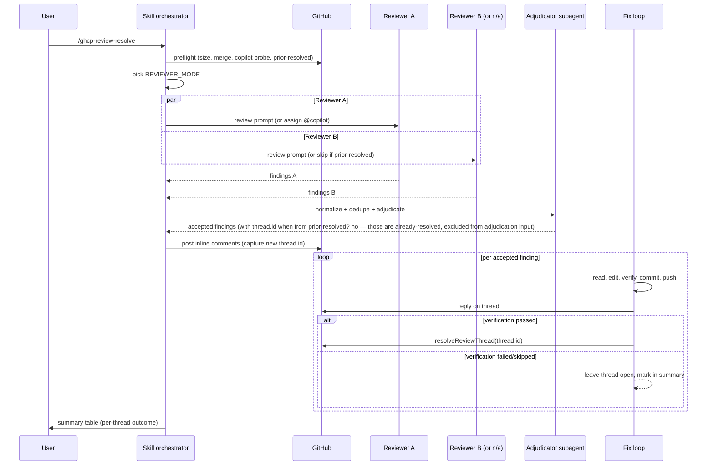

# feat: ghcp-review-resolve dual-subagent fallback and inline resolve

**Target file:** `~/.claude/skills/ghcp-review-resolve/SKILL.md` (global user skill — file paths in this plan are relative to that skill file unless otherwise noted)

## Overview

Two gaps in the current `ghcp-review-resolve` skill:

1. **Single-reviewer fallback is too thin.** When Copilot is unavailable (org without Copilot code review enabled, or 422/not-a-collaborator), the skill drops to pr-review-toolkit alone. That loses the "two independent reviewers, overlap is high-confidence" signal that the whole adjudication step depends on. The user wants: when Copilot can't run, spawn **two** distinct subagent reviewers instead — preserving the dual-reviewer adjudication property.

2. **Threads are replied to but never resolved.** After fixing and replying, the GitHub review threads stay open. Reviewers (and the next run of this skill) see them as outstanding. The user wants: after a verified fix-and-reply, resolve the thread on GitHub. After all replies are posted, summarize back to the user in chat.

This plan reshapes Step 1 (reviewer dispatch) into a 3-mode decision tree, and extends Step 6 with a resolve sub-step gated on verified fixes.

## Problem Frame

Concretely, the current skill behavior:

- `EXPECTED_REVIEWERS` is always `{pr-review-toolkit}` plus optionally `copilot`. Never two subagent reviewers.
- The fix loop posts replies via `POST /pulls/{n}/comments` with `in_reply_to=<id>`, but never calls the GraphQL `resolveReviewThread` mutation.
- Single-reviewer mode is degraded by design — the adjudicator note says "loses the 'both bots flagged it' signal".

What the user wants:

| Preflight state | Reviewers |
|---|---|
| Copilot already reviewed AND threads resolved-fresh | 1 subagent reviewer (Copilot's prior verdict + 1 independent) |
| Copilot available, no prior review | Copilot + 1 subagent reviewer |
| Copilot unavailable | 2 distinct subagent reviewers (security-focused + quality-focused) |

And the fix-loop should: reply on the thread, then resolve the thread, **only if the fix was actually verified**.

## Requirements Trace

- R1. When Copilot is unavailable for the run, the skill must dispatch two distinct subagent reviewers (security + quality) and treat their findings as the dual-reviewer pair for adjudication overlap.
- R2. When Copilot's prior review on this PR is resolved-and-fresh at the current HEAD, the skill must run only one additional subagent reviewer and feed the prior Copilot findings (already accepted by virtue of being resolved) plus the new subagent's findings to adjudication.
- R3. When Copilot is available and no prior resolved review exists, the skill must run Copilot plus one subagent reviewer (current behavior, but explicitly named).
- R4. After replying on a review comment thread with the fix description, the skill must resolve that thread on GitHub — but only if the fix was edited, committed, pushed, and verified (tests/build/lint passed). Unverified or skipped fixes must reply but NOT resolve.
- R5. Final chat summary must include per-thread outcome: replied+resolved / replied-only (verification skipped or failed) / not-actioned.
- R6. Existing guardrails (no approve, no merge, no close, never act on adjudicator-rejected findings, stop on mid-run head-SHA change) remain intact across all three reviewer modes and the new resolve step.
- R7. The reviewer-mode decision must be deterministic from preflight flags — no mid-run mode switching.

## Scope Boundaries

In scope:
- Reviewer-dispatch decision tree (3 modes)
- Two new subagent reviewer roles (security-focused + quality-focused) with prompt scaffolding
- One subagent reviewer role used in the "1 additional" cases (general-purpose code-reviewer)
- GraphQL `resolveReviewThread` integration in the fix loop
- Verification-gated resolve policy
- Summary table extension to show resolve state

Out of scope:
- Changing the adjudicator subagent (Step 4) — it already operates on a list of findings; it doesn't care whether they came from Copilot, pr-review-toolkit, or two subagents
- Adding a third subagent reviewer
- Changing how Copilot is configured on the org (still a repo admin task)
- Resolving threads that this skill did not create or did not directly act on
- Bulk-resolve at end-of-run (per-thread resolve happens inside the fix loop, not after)
- Making the skill language-aware beyond the existing per-language verification hint

## Context & Research

### Relevant Code and Patterns

- `~/.claude/skills/ghcp-review-resolve/SKILL.md` — the only file changing
- Step 0f (Copilot probe) — already produces `COPILOT_AVAILABLE`
- Step 0g (prior-resolved check) — already produces `PRIOR_RESOLVED`
- Step 0j (preflight flags) — `EXPECTED_REVIEWERS` derivation; this is what the new decision tree replaces
- Step 1a/1b — current Copilot + pr-review-toolkit dispatch
- Step 4 — adjudicator subagent prompt; takes a flat findings list, source-agnostic
- Step 6 step 6 — `gh api .../comments -X POST -F in_reply_to=<id>` reply pattern (already correct, just needs resolve added after)

### Institutional Learnings

- Global instinct (90%): "Run two independent reviewers with different focus areas (security + quality) in parallel. Neither reviewer should have written the code. Compare findings — overlapping issues are highest confidence, unique findings from each are the bonus." This plan operationalizes that instinct as the Copilot-unavailable fallback.
- Global instinct (80%): "When a feature requires creating 3+ files that don't depend on each other ... spawn parallel agents — one per file group." Reviewers in this plan run in parallel via a single message with multiple Agent tool calls.
- Prior plan `2026-04-24-001-fix-ghcp-review-resolve-skill-robustness-plan.md` already established the 3-state preflight matrix this plan extends.

### External References

- GitHub GraphQL `resolveReviewThread` mutation: https://docs.github.com/en/graphql/reference/mutations#resolvereviewthread — takes `threadId` (the GraphQL node ID, not the REST comment ID) and returns the updated thread. Requires `repo` scope; `gh auth` already provides this.
- The thread ID is reachable from the same `reviewThreads` query Step 0g already runs. The skill needs to retain `thread.id` (not just `comments[0].id`) when collecting findings so it can resolve later.

## Key Technical Decisions

- **Decision: Three reviewer modes, derived from preflight flags, named explicitly.**
  Rationale: The current skill conflates "Copilot unavailable" with "single-reviewer mode" which loses the dual-reviewer property. Naming the modes (`copilot-plus-subagent`, `prior-resolved-plus-subagent`, `dual-subagent`) makes the decision auditable in logs and the preflight table.

- **Decision: Two subagents in `dual-subagent` mode use a security/quality split, not two general-purpose reviewers.**
  Rationale: User chose this in planning. Reduces redundancy — two general reviewers tend to flag the same surface-level issues; specialized reviewers diversify the finding set, which makes overlap a stronger signal when it occurs and gives unique findings clearer provenance.

- **Decision: Thread resolution is gated on verification, not on edit success.**
  Rationale: User chose this. An unverified fix replied with "not independently verified" should NOT close the thread — the human reviewer needs to see it's still open. This matches the global rule that fix-fatigue is real and silent hand-waving is worse than admitting uncertainty.

- **Decision: Resolve happens per-thread inside the fix loop, immediately after the reply.**
  Rationale: Keeps the per-finding state machine local. End-of-run bulk-resolve would have to re-derive verification state, doubling the surface area for bugs.

- **Decision: When Copilot's prior review is resolved-and-fresh, treat those prior findings as already-accepted (no re-adjudication) and only adjudicate the new subagent's findings.**
  Rationale: The threads were resolved by a human; second-guessing that with another adjudication pass adds noise without signal. The new subagent's job in that mode is to find anything Copilot missed or anything that regressed since.

- **Decision: Prior-resolved Copilot threads are NOT touched by this skill's resolve step.**
  Rationale: They're already resolved. Re-resolving an already-resolved thread is a no-op at best; at worst it surfaces as activity in the PR timeline. Skip.

- **Decision: Subagent reviewers post their findings back to the orchestrator as structured data, not as PR comments.**
  Rationale: pr-review-toolkit posts directly to the PR; subagent reviewers in this skill operate one layer earlier — they hand findings to the adjudicator. Posting from both subagent reviewers AND the adjudicator would duplicate inline comments.

## Open Questions

### Resolved During Planning

- Q: Should both subagents be code-reviewer agents, or one specialized? → A: Security-focused + quality-focused split (user choice; matches global instinct).
- Q: Should resolve be unconditional or verification-gated? → A: Verification-gated (user choice).
- Q: When prior Copilot review is resolved-and-fresh, should we skip the additional subagent too? → A: No — the additional subagent is the "did anything regress since the prior review" check. Always run one in that mode.
- Q: Can we resolve threads via REST? → A: No. GitHub only exposes resolution via GraphQL `resolveReviewThread`. The query in Step 0g already uses GraphQL, so the dependency is consistent.
- Q: What if the GraphQL resolve mutation fails? → A: Fall back to logging the failure, leaving the thread open, and noting it in the summary. Do not retry indefinitely.

### Deferred to Implementation

- The exact subagent reviewer prompts may need iteration after first real-world runs. The plan defines the role split and required output shape; tuning the prompt language is an execution-time concern.
- Whether to cache the thread-id ↔ comment-id mapping in `/tmp/ghcp-thread-map.json` or thread it through Python-style return values is an implementation choice. The contract is: at fix-loop time, every accepted finding must know its `thread.id` for resolution.

## High-Level Technical Design

> *This illustrates the intended approach and is directional guidance for review, not implementation specification. The implementing agent should treat it as context, not code to reproduce.*

### Reviewer mode decision tree (replaces current Step 0j `EXPECTED_REVIEWERS` derivation)

```
preflight flags: COPILOT_AVAILABLE, PRIOR_RESOLVED

if PRIOR_RESOLVED:
    REVIEWER_MODE = "prior-resolved-plus-subagent"
    EXPECTED_REVIEWERS = {"subagent-general"}
    PRIOR_FINDINGS_SOURCE = "copilot-resolved-threads"   # treated as accepted

elif COPILOT_AVAILABLE:
    REVIEWER_MODE = "copilot-plus-subagent"
    EXPECTED_REVIEWERS = {"copilot", "subagent-general"}
    PRIOR_FINDINGS_SOURCE = none

else:
    REVIEWER_MODE = "dual-subagent"
    EXPECTED_REVIEWERS = {"subagent-security", "subagent-quality"}
    PRIOR_FINDINGS_SOURCE = none
```

### End-to-end pipeline (mode-aware)



### Findings record shape (extended)

```
finding := {
  source: "copilot" | "pr-toolkit" | "subagent-security" | "subagent-quality" | "subagent-general" | "copilot-prior-resolved",
  file, line, severity, body,
  comment_id,        // REST id, for in_reply_to
  thread_id,         // GraphQL node id, for resolveReviewThread (set when known)
  overlap: bool,
  pre_accepted: bool // true only for copilot-prior-resolved findings — bypasses adjudicator
}
```

## Implementation Units

- [ ] **Unit 1: Add reviewer-mode decision tree to preflight (Step 0j)**

**Goal:** Replace the existing `EXPECTED_REVIEWERS` derivation with a named, three-mode decision tree.

**Requirements:** R1, R2, R3, R7

**Dependencies:** None

**Files:**
- Modify: `~/.claude/skills/ghcp-review-resolve/SKILL.md` (Step 0j, and the preflight table in Step 0h)

**Approach:**
- Replace the single-line `EXPECTED_REVIEWERS` derivation with explicit `REVIEWER_MODE` + `EXPECTED_REVIEWERS` + `PRIOR_FINDINGS_SOURCE` flag set
- Add a row to the preflight table: `Reviewer mode    <copilot-plus-subagent | prior-resolved-plus-subagent | dual-subagent>`
- Update the "Decision" line to reference `REVIEWER_MODE` so the user sees it before any reviewer is dispatched
- Update Step 0i's short-circuit ("nothing useful to do") to use the mode names — large + dual-subagent without `--force` is still allowed (user wanted dual-subagent fallback to actually run); large + prior-resolved-plus-subagent without `--force` keeps current short-circuit behavior

**Patterns to follow:**
- Existing flag block in Step 0j (`PR_NUMBER`, `PR_HEAD_SHA`, etc.) — keep the same prose-with-bash-snippet style
- Existing preflight-table layout in Step 0h

**Test scenarios:**
- Edge case: prior-resolved + copilot-available → should pick `prior-resolved-plus-subagent` (PRIOR_RESOLVED takes precedence over COPILOT_AVAILABLE in the tree)
- Edge case: copilot-unavailable + no-prior-review → `dual-subagent`
- Edge case: copilot-available + no-prior-review → `copilot-plus-subagent`
- Edge case: copilot-unavailable + prior-resolved-stale → `dual-subagent` (stale doesn't count as "resolved" for skip purposes — current Step 0g behavior preserved)
- Happy path: preflight table renders the new `Reviewer mode` row and the matching decision line

**Verification:**
- Reading Step 0 end-to-end, a human can trace any combination of (COPILOT_AVAILABLE, PRIOR_RESOLVED) to exactly one `REVIEWER_MODE` without ambiguity

- [ ] **Unit 2: Replace Step 1 reviewer dispatch with mode-aware dispatcher**

**Goal:** Step 1 now branches on `REVIEWER_MODE` and dispatches the right reviewers in parallel (single message, multiple Agent tool calls per the global parallel-agent instinct).

**Requirements:** R1, R2, R3

**Dependencies:** Unit 1

**Files:**
- Modify: `~/.claude/skills/ghcp-review-resolve/SKILL.md` (Step 1, Step 1a, Step 1b — restructure into Step 1a/b/c by mode)

**Approach:**
- Drop `pr-review-toolkit` from the default reviewer set. (Existing behavior makes pr-review-toolkit always-on; this plan replaces that with the mode-driven set. Not a regression — pr-review-toolkit can still be invoked manually via `/pr-review-toolkit:review-pr` if a user wants it.)
- Step 1a (`copilot-plus-subagent`): assign `@copilot` reviewer + spawn one general-purpose subagent code reviewer in the same turn
- Step 1b (`prior-resolved-plus-subagent`): spawn one general-purpose subagent code reviewer (no Copilot re-request); preload `PRIOR_FINDINGS` from the resolved Copilot threads as `pre_accepted=true` records
- Step 1c (`dual-subagent`): spawn `subagent-security` + `subagent-quality` in the same turn (parallel via single message, multiple Agent tool calls)
- Each subagent prompt receives: PR number, head SHA, base ref, size class, the diff (full for `small`, per-file file list for `large`), and a focused role description
- Subagents return structured findings as JSON (same shape as Step 3 normalizes to), not PR comments

**Patterns to follow:**
- Existing pr-review-toolkit Skill() invocation style for inspiration on argument shape
- The "parallel via single message" pattern documented in the user's global agents.md rule

**Test scenarios:**
- Happy path (`copilot-plus-subagent`): both reviewers fire in one turn; orchestrator collects findings from both
- Happy path (`dual-subagent`): security and quality subagents fire in parallel; their findings carry distinct `source` values
- Happy path (`prior-resolved-plus-subagent`): only one new reviewer runs; prior Copilot findings are loaded with `pre_accepted=true`
- Edge case: subagent reviewer crashes or returns malformed JSON → log, treat that reviewer as zero findings, continue with the others (don't abort pipeline)
- Edge case: in `dual-subagent` mode, if one of the two subagents returns nothing usable, the run continues with one reviewer's findings only and the summary notes "degraded to single-reviewer findings due to subagent-X failure"
- Integration: parallel dispatch must happen in a single orchestrator message containing multiple Agent tool calls — not sequential

**Verification:**
- Step 1 prose explicitly names which reviewers fire in each mode and why
- The dispatch instruction tells the implementer to use a single message with multiple parallel Agent tool calls when two reviewers are needed

- [ ] **Unit 3: Define security-focused and quality-focused subagent reviewer prompts**

**Goal:** Codify the role split for `dual-subagent` mode and the general role for `copilot-plus-subagent` / `prior-resolved-plus-subagent` modes.

**Requirements:** R1

**Dependencies:** Unit 2

**Files:**
- Modify: `~/.claude/skills/ghcp-review-resolve/SKILL.md` (new subsection under Step 1 or a small reference section; choose the location that keeps Step 1 scannable)

**Approach:**
- Define three reviewer prompt scaffolds (security, quality, general) — each ~10–15 lines of instructions
- Security reviewer focuses: auth/authz, input validation, injection, secrets, data exposure, unsafe deserialization, race conditions with security implications, OWASP Top 10
- Quality reviewer focuses: correctness bugs, error handling, resource leaks, edge cases, complexity, naming, dead code, maintainability, test coverage gaps
- General reviewer focuses: a balanced superset (used when the second axis of diversity comes from Copilot or prior-Copilot rather than from the role)
- Each prompt requires a JSON output shape matching the Step 3 finding record (file, line, severity, body)
- Each prompt explicitly instructs: do NOT post PR comments yourself, return findings to the orchestrator only
- Each prompt receives the same diff/file context the adjudicator gets in Step 4

**Patterns to follow:**
- Existing adjudicator subagent prompt in Step 4 (independence framing, "did NOT write the code")
- User's global instincts file: security + quality split is already the canonical phrasing

**Test scenarios:**
- Happy path: a security finding (e.g., unsanitized user input flows to SQL) is more likely to surface from the security reviewer than the quality reviewer
- Happy path: a maintainability finding (e.g., a 200-line function with deep nesting) is more likely to surface from the quality reviewer
- Edge case: an issue that crosses both axes (e.g., a race condition that's both a correctness bug and a security risk) should surface in both — that overlap is exactly the signal the adjudicator uses
- Integration: subagent JSON outputs are directly consumable by the existing Step 3 normalizer without transformation

**Verification:**
- Each role's prompt is concrete enough that re-running the skill with the same inputs would produce roughly the same finding set (low-variance reviewer behavior)
- The "do not post PR comments yourself" instruction is unambiguous — the orchestrator owns the PR-comment surface

- [ ] **Unit 4: Adjudicator pre-accepts prior-resolved Copilot findings**

**Goal:** When `REVIEWER_MODE == prior-resolved-plus-subagent`, prior Copilot findings bypass adjudication (already accepted by virtue of being resolved by a human) and only the new subagent's findings go through the adjudicator.

**Requirements:** R2

**Dependencies:** Unit 1, Unit 2

**Files:**
- Modify: `~/.claude/skills/ghcp-review-resolve/SKILL.md` (Step 4 prompt scaffold and Step 3 normalization)

**Approach:**
- In Step 3, mark prior-resolved Copilot findings with `pre_accepted=true` and skip them when building the adjudicator input
- Note in Step 4: prior-resolved findings are already accepted; they are NOT re-adjudicated
- Make sure prior-resolved findings still flow into Step 5 only if there's a NEW edit needed — but typically they don't, because they're already resolved. Most concretely: prior-resolved findings appear in the final summary as "previously resolved by human reviewer" but generate no new PR comments and no new edits
- Add a guard: a prior-resolved finding that the new subagent independently re-flags (regression detection) should be lifted to a NEW finding under the subagent's source, with a note "regression of previously-resolved finding"

**Patterns to follow:**
- Existing Step 3 dedup logic (file + overlapping line range + similar body) — extend with a regression check against prior-resolved findings

**Test scenarios:**
- Happy path: 8 prior-resolved findings + 0 new subagent findings → 0 new comments posted, summary lists "8 prior-resolved (no action needed)"
- Edge case: 8 prior-resolved + 1 new subagent finding that flags one of the same file/line ranges → that finding gets posted as a new comment with "regression of previously-resolved finding" framing
- Edge case: prior-resolved finding's referenced file no longer exists in the diff → drop silently (already-resolved + file removed = no concern)
- Integration: adjudicator input contains zero prior-resolved findings; adjudicator output is unaffected by the prior-resolved set

**Verification:**
- Adjudicator subagent prompt in Step 4 explicitly states it receives only non-pre-accepted findings
- Final summary distinguishes "prior-resolved" from "newly accepted" counts

- [ ] **Unit 5: Capture thread.id when posting inline comments**

**Goal:** Step 5 (post inline comments) currently only captures REST `comment_id`. Extend it to also capture the GraphQL `thread.id` so Step 6 can resolve the thread later.

**Requirements:** R4

**Dependencies:** None

**Files:**
- Modify: `~/.claude/skills/ghcp-review-resolve/SKILL.md` (Step 5)

**Approach:**
- After posting the review with `event=COMMENT`, the response includes `comments[].id` (REST) but not the thread node ID. Run a follow-up GraphQL query to map each newly-posted REST comment ID to its `pullRequestReviewThread.id`
- Cache the mapping on the in-memory finding records: `finding.thread_id = <GraphQL id>`
- If the GraphQL mapping query fails for a particular comment, log it and leave `thread_id=null`; that finding will reply but not resolve in Step 6, with summary noting "thread id unavailable, left open"

**Patterns to follow:**
- Existing GraphQL query in Step 0g — reuse the `reviewThreads(first: 100)` query, filter to threads where `comments.nodes[].databaseId == <our REST comment id>`

**Test scenarios:**
- Happy path: 4 inline comments posted → 4 thread IDs captured, all findings have `thread_id` set
- Edge case: GraphQL pagination — if the PR has >100 review threads (unlikely but possible on long-lived PRs), paginate or use `last:` to find the most recent threads
- Edge case: GraphQL query fails (auth scope, transient error) → 4 comments still posted, thread_id null, Step 6 replies but does not resolve, summary flags it
- Integration: thread_id capture happens after the POST review call returns, before Step 6 starts iterating

**Verification:**
- Every accepted finding either has `thread_id` set or has a logged reason why it doesn't
- Step 5 prose explicitly notes that thread_id capture is required for Step 6's resolve substep

- [ ] **Unit 6: Add resolve substep to Step 6 fix loop, gated on verification**

**Goal:** After replying on a comment thread with the fix description, resolve the thread on GitHub — but only if the fix was edited, committed, pushed, AND verification passed.

**Requirements:** R4, R6

**Dependencies:** Unit 5

**Files:**
- Modify: `~/.claude/skills/ghcp-review-resolve/SKILL.md` (Step 6, specifically substeps 6 and 7 — extend with a 6.5 "resolve thread")

**Approach:**
- Add a per-finding `verified` boolean tracked through substeps 2–5: starts false, set true only when verification (substep 3) explicitly passes
- After substep 6 (reply posted), if `verified=true` AND `thread_id` is non-null, call:

  ```graphql
  mutation { resolveReviewThread(input: {threadId: "<id>"}) { thread { id isResolved } } }
  ```

- If `verified=false` (skipped, repair-failed, or no test command found), reply mentions verification status and the thread is left open; summary records "replied, not resolved (verification: <reason>)"
- If the GraphQL resolve mutation itself fails, log the error and treat the thread as replied-only; do not retry indefinitely (one retry max, then give up and surface in summary)
- Re-check `PR_HEAD_SHA` before the resolve call — if HEAD has moved, treat it the same as the existing Step 5 head-SHA-changed guardrail (stop, don't resolve, surface)

**Patterns to follow:**
- Existing Step 5 head-SHA recheck pattern
- Existing Step 6 substep 6 (`gh api ... -F in_reply_to=<id>`) reply pattern

**Test scenarios:**
- Happy path: 4 findings, all verified → 4 replies + 4 resolves; PR shows all 4 threads resolved
- Edge case (mixed): 4 findings, 3 verified + 1 skipped (verification couldn't be run) → 3 replies+resolves, 1 reply-only with "not independently verified" in body
- Edge case (mixed): 4 findings, 3 verified + 1 verification failed after one retry → 3 replies+resolves, 1 revert + reply-only with "fix attempted, verification failed twice, reverted"
- Edge case: GraphQL resolve mutation returns 4xx → reply already posted, thread stays open, summary flags it as "replied, resolve mutation failed"
- Edge case: HEAD moved between reply and resolve → stop the loop entirely (per existing guardrail), don't resolve any further threads
- Integration: a thread that was already resolved by a human between the post and the resolve call → mutation is idempotent (resolving an already-resolved thread is a no-op in GitHub's API), so this is safe; just log "already resolved" and continue
- Error path: thread_id is null (Unit 5 capture failed for this comment) → reply-only, summary flags "thread id unavailable, left open"

**Verification:**
- Step 6 prose explicitly defines the verified→resolve gate
- The resolve substep is unambiguously tied to the per-finding `verified` flag, not to "did the edit happen"
- Guardrails section is updated to note that `resolveReviewThread` is the only mutation that may close threads, and only on verified fixes

- [ ] **Unit 7: Extend Step 7 final summary with per-thread outcome table**

**Goal:** The final chat summary should make it obvious which threads were verified+resolved, replied-only, or never actioned. User explicitly asked for "summarize back to user in chat" after all the resolution work.

**Requirements:** R5

**Dependencies:** Unit 6

**Files:**
- Modify: `~/.claude/skills/ghcp-review-resolve/SKILL.md` (Step 7)

**Approach:**
- Add a per-thread outcome table to the final summary:

  ```
  Threads acted on:
    Thread (file:line)              Outcome
    ──────────────────────────────  ──────────────────────────────────
    src/auth.go:88                  fixed + verified + resolved (commit def456)
    src/api.go:142                  fixed + verified + resolved (commit ghi789)
    src/cache.go:203                replied — verification failed, reverted
    src/util.go:55                  replied — thread id unavailable
  ```

- Add a one-line mode summary up top: `Reviewer mode: dual-subagent (security + quality)`
- Keep all existing summary fields (PR URL, preflight outcome, fixes, guardrails confirmation)
- Final line stays unchanged: **PR was not closed, approved, or merged.**

**Patterns to follow:**
- Existing Step 7 markdown layout

**Test scenarios:**
- Happy path: all threads resolved → table is uniform "fixed + verified + resolved"
- Mixed: some skipped → outcomes column makes the reason scannable in one line each
- Edge case: zero accepted findings → table is omitted, summary just notes "0 findings accepted by adjudicator"
- Integration: each row's data comes directly from the per-finding state from Unit 6

**Verification:**
- A user reading only the summary can answer: which threads are still open and why?

- [ ] **Unit 8: Update Guardrails and Examples sections**

**Goal:** Reflect the new modes and the resolve mutation in the skill's Guardrails and Example runs sections so they don't drift from behavior.

**Requirements:** R6

**Dependencies:** Units 1–7 (cosmetic dependency — examples should reflect actual behavior)

**Files:**
- Modify: `~/.claude/skills/ghcp-review-resolve/SKILL.md` (Guardrails section, Example runs section)

**Approach:**
- Guardrails: add "Never resolve a review thread for a fix that was not verified" as an explicit rule. Keep all existing guardrails verbatim.
- Examples: replace Example 3 ("single-reviewer mode on a large PR") with a `dual-subagent` mode example showing security + quality reviewers, the adjudicator output, and per-thread resolve outcomes. Update Example 1 to mention the new `Reviewer mode` row in the preflight table. Update Example 2 (degraded path / merge conflict) — no behavior change there, just preserve.
- Add an Example 4 covering `prior-resolved-plus-subagent` mode where prior 8 Copilot findings are pre-accepted and 0 new findings come from the subagent → skill exits cleanly with summary noting all prior threads remain resolved.

**Patterns to follow:**
- Existing Example 1/2/3 formatting

**Test scenarios:**
- Test expectation: none -- documentation/example update with no behavioral assertion. The verification is human-read coherence between examples and the new Steps 0–7.

**Verification:**
- Each example's "Decision:" line and reviewer dispatch matches the mode it claims
- The Guardrails list contains the new "never resolve unverified" rule

## System-Wide Impact

- **Interaction graph:** Three subagent reviewer roles join the existing adjudicator subagent — four subagent roles total in this skill. The adjudicator is unchanged in behavior but receives input from a wider set of sources.
- **Error propagation:** Subagent reviewer failures must NOT abort the pipeline (current pr-review-toolkit failure behavior is preserved and extended). Resolve mutation failures must NOT abort the fix loop — they're per-thread degradations, not pipeline blockers.
- **State lifecycle risks:** The `verified` flag travels through substeps 2–5 of Step 6; if the implementation drops it on the floor (e.g., reset between substeps), threads will be resolved that shouldn't be. Test scenario in Unit 6 covers this.
- **API surface parity:** The skill currently has implicit reviewer modes (Copilot+toolkit, toolkit-only). After this plan, modes are explicit and named. Any other skill that orchestrates reviews can model this same pattern.
- **Integration coverage:** The cross-layer behavior — preflight flag → mode selection → reviewer dispatch → finding source attribution → adjudicator input → comment post → reply → resolve — must hold end-to-end in each mode. Unit-level test scenarios cover individual hops; the example runs in Unit 8 are the integration check.
- **Unchanged invariants:** Guardrails (no approve/merge/close, never act on adjudicator-rejected findings, stop on mid-run head-SHA change). The 30s/10min poll cadence in Step 2 is unchanged. The size-class diff strategy from the prior plan is unchanged. pr-review-toolkit is dropped from the always-on default reviewer set; users who want it can still invoke it manually via `/pr-review-toolkit:review-pr`. This is the one intentional behavior break vs. the prior plan; it is called out here so reviewers can confirm the trade-off.

## Risks & Dependencies

| Risk | Mitigation |
|------|------------|
| Two subagent reviewers produce highly correlated findings (security/quality split is too thin) | Adjudicator still runs and trims noise; if real-world signal is weak, the prompt scaffolds in Unit 3 are easy to retune without reshaping the skill |
| `resolveReviewThread` GraphQL mutation requires a scope `gh auth` doesn't provide on some setups | Falls back to reply-only with an explicit summary flag; user can manually resolve. Detected on first call, not as a precondition (don't gate the whole skill on it) |
| Thread ID capture race (Unit 5) — GitHub may not have indexed the new thread by the time the GraphQL query runs | One retry with a 2s sleep before falling back to thread_id=null. Documented in Unit 5 implementation guidance |
| pr-review-toolkit users notice the always-on behavior was dropped | Surfaced in System-Wide Impact above and in Unit 2 Approach. If demand emerges, an opt-in flag can re-add it without reshaping the modes |
| Prior-resolved Copilot finding flagged as a regression by the new subagent (Unit 4) — false positive risk | Adjudicator still runs on regression-flagged findings before they become PR comments; this is the existing tiebreaker mechanism doing its job |
| HEAD SHA changes mid-fix-loop — current guardrail handles edits, plan extends it to the new resolve substep | Unit 6 scenario covers this explicitly |

## Documentation / Operational Notes

- The skill description in the YAML frontmatter (`description: ...`) should be updated to mention "two distinct subagent reviewers when Copilot is unavailable" and "resolves threads after verified fixes" so the trigger heuristics in the agent harness pick up the right invocations. Cosmetic but high-value for skill discoverability.
- No migration concerns — the skill is global user-state, not repo-state. Each next invocation just picks up the new behavior.

## Sources & References

- **Origin document:** [docs/plans/2026-04-24-001-fix-ghcp-review-resolve-skill-robustness-plan.md](2026-04-24-001-fix-ghcp-review-resolve-skill-robustness-plan.md) — established the 3-state preflight matrix this plan extends
- Skill source: `~/.claude/skills/ghcp-review-resolve/SKILL.md`
- Global instinct on dual-reviewer security+quality split (90% confidence)
- GitHub GraphQL `resolveReviewThread` mutation: https://docs.github.com/en/graphql/reference/mutations#resolvereviewthread
