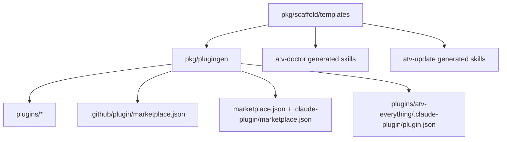

# feat: Clean VS Code source install and AgentPlugin updates

## Summary

This plan keeps ATV's generator as the source of truth, adds a curated VS Code source-install AgentPlugin surface, and extends the generated maintenance skills so source-installed plugins can be diagnosed and updated safely. The implementation validates the picker surface early, preserves the project scaffold path, and keeps Copilot CLI granular while positioning `atv-everything` as the CLI flagship default.

---

## Problem Frame

ATV currently projects its full Copilot CLI plugin marketplace into the metadata VS Code reads during `Chat: Install Plugin from source`, so first-time VS Code users see dozens of internal packs and single-skill plugins instead of one coherent ATV product. The same source-installed plugin lifecycle is also opaque after install: users have to inspect plugin folders, git state, and versions manually to know whether a VS Code AgentPlugin is stale.

The Copilot CLI catalog already contains the right full-bundle default, `atv-everything`. The implementation should not remove the granular CLI catalog in v1; it should preserve those advanced choices while ensuring VS Code sees only the curated source-install entry and CLI docs/tests keep `atv-everything` in the flagship position.

---

## Assumptions

*This plan was authored without another synchronous confirmation after research. The items below are plan-time bets that should be validated in the first implementation unit and reviewed before merge.*

- VS Code source install reads marketplace definition files in this order: `marketplace.json`, `.plugin/marketplace.json`, `.github/plugin/marketplace.json`, `.claude-plugin/marketplace.json`. Because `.github/plugin` wins over `.claude-plugin`, ATV needs a curated root `marketplace.json` for the VS Code source-install surface while preserving `.github/plugin/marketplace.json` for Copilot CLI.
- The `.claude-plugin/marketplace.json` catalog can still be generated as Claude-format metadata, but it is not sufficient by itself while ATV also carries a granular `.github/plugin/marketplace.json`.
- Review found two implementation blockers to address before further validation: `compareFile` must be a package-level helper so Go compiles, and the generator must not write the granular CLI catalog to root `marketplace.json`.
- Source-installed AgentPlugin updates should treat plugin directories as git checkouts. No official VS Code AgentPlugin update command was found in the current VS Code extension and AI extensibility docs.
- `/atv-doctor` should report all GitHub-source AgentPlugins under VS Code roots, while `/atv-update` should default to updating ATV and require an explicit plugin/repo selection before updating non-ATV plugins.

---

## Requirements

- R1. VS Code source install must show one primary ATV option, named clearly enough that a first-time user can select it without reading ATV's marketplace docs.
- R2. The primary option description must be short, user-facing, and fit comfortably in VS Code's Quick Pick row without relying on long warnings, URLs, or implementation notes.
- R3. The option should represent the complete recommended ATV personal plugin experience for VS Code, not a partial skill, hidden dependency, or expert-only bundle.
- R4. Individual skill plugins and category packs must not appear in the VS Code source-install picker for the default ATV repository install flow.
- R5. The project-level `npx atv-starterkit init` flow remains separate and continues to be documented as the team/shared repo bootstrap path.
- R6. Copilot CLI marketplace support may remain granular, but it must position `atv-everything` as the recommended full install and must not force the VS Code source-install picker to expose every granular ATV package.
- R7. If VS Code and Copilot CLI cannot use separate catalogs cleanly, prioritize the one-option VS Code source-install experience for this change and defer granular CLI preservation to a follow-up.
- R8. ATV documentation must include the VS Code source-install flow using the current command palette wording: `Chat: Install Plugin from source`.
- R9. Documentation must explain the difference between VS Code source install, Copilot CLI plugin install, and `npx atv-starterkit init` without making users choose from a large matrix before the quick start; Copilot CLI docs must lead with `atv-everything` before advanced granular installs.
- R10. A release or validation check must catch drift where the VS Code source-install surface grows beyond the intended single primary option.
- R11. ATV health/update workflows must detect source-installed AgentPlugins under the VS Code and VS Code Insiders agent plugin roots, including repositories installed from GitHub source.
- R12. The workflow must report a source-installed plugin's repository owner/name, current branch, current commit, version metadata when available, and whether the local checkout differs from its remote tracking branch.
- R13. Updating a source-installed plugin must be opt-in and must avoid overwriting local changes silently; dirty or diverged worktrees require an explicit remediation choice.
- R14. If a clean in-place update is not possible, the workflow may offer a reinstall/removal path only after showing the exact plugin folder that would be removed and receiving explicit confirmation.
- R15. After any successful update, the workflow must tell the user how to make VS Code load the new plugin content, including reload/restart guidance when needed.

**Origin actors:** A1 VS Code Copilot user, A2 ATV maintainer, A3 Copilot CLI user, A4 source-installed plugin user.

**Origin flows:** F1 Clean VS Code source install, F2 Maintainer validation, F3 Source-installed plugin update.

**Origin acceptance examples:** AE1 covers R1/R2/R4, AE2 covers R3, AE3 covers R5/R9, AE4 covers R10, AE5 covers R11/R12, AE6 covers R13/R14/R15.

---

## Scope Boundaries

- Do not build a full VS Code extension, VSIX package, chat participant, language model tool, or Visual Studio Marketplace listing in this v1.
- Do not change ATV skill or agent behavior except for generated packaging metadata and the `atv-doctor` / `atv-update` maintenance instructions.
- Do not redesign `npx atv-starterkit init`, its templates, MCP config, hooks, or project scaffold installer behavior.
- Do not require VS Code users to understand Copilot CLI marketplace mechanics before installing ATV from source.
- Do not remove Copilot CLI pack, single-skill, or agents-only plugins in this v1; preserve them as advanced/granular options.
- Do not rename the Copilot CLI full bundle from `atv-everything` as part of this change.
- Do not silently update, reset, delete, or reinstall any source-installed plugin folder.
- Do not treat generated `plugins/` files as canonical source; template and generator changes remain authoritative.

### Deferred to Follow-Up Work

- Removing or collapsing Copilot CLI granularity: defer unless user demand or maintenance cost proves the advanced catalog is harmful. For v1, keep granularity but make `atv-everything` the obvious default.
- Full VS Code extension publishing: evaluate only after the source-install path is clean and maintainers know whether a Marketplace extension is worth the extra release surface.
- Project scaffold refresh support: leave the additive-only `atv init` limitation unchanged.

---

## Context & Research

### Relevant Code and Patterns

- `pkg/plugingen/generate.go` generates every plugin directory and catalog metadata from `pkg/scaffold/templates/`. The intended split is that `writeMarketplace` emits the granular Copilot CLI catalog under `.github/plugin/marketplace.json`, while the source-install generator emits a curated root `marketplace.json` plus `.claude-plugin/marketplace.json`. The current branch needs a corrective fix because review found the generator still writes the CLI catalog to the root path.
- `pkg/plugingen/generate_test.go` already mirrors templates into a temp repo and validates deterministic generation. It contains the current noisy-regression test, `TestGenerate_MarketplaceListsEveryPlugin`, which should remain useful for the Copilot CLI catalog if a separate VS Code catalog is added.
- `pkg/plugingen/manifest.go` models both the Copilot CLI marketplace shape and the curated source-install marketplace shape.
- `cmd/plugingen/main.go` reads `VERSION` and runs `Generate` or `CheckClean`; the drift check is already wired into CI through `.github/workflows/ci.yml`.
- `pkg/scaffold/templates/skills/atv-doctor/SKILL.md` and `pkg/scaffold/templates/skills/atv-update/SKILL.md` are the canonical maintenance skill sources. Generated copies under `plugins/` should be updated only by regeneration.
- CE's installed source plugin informed the `.claude-plugin/plugin.json` per-plugin metadata shape. VS Code's current marketplace-definition order requires ATV's curated source-install picker to be exposed through root `marketplace.json` as well.

### Institutional Learnings

- `docs/solutions/developer-experience/validate-ce-agent-plugin-installation-2026-04-28.md` shows the reliable validation path for source-installed CE plugins: inspect the actual installed AgentPlugin directory under the VS Code Insiders root, read package/version metadata from that directory, inspect git status/log/describe there, and treat manual folder removal as destructive with exact-path confirmation.

### External References

- `EveryInc/compound-engineering-plugin#637` documents the current VS Code source-install flow: run `Chat: Install Plugin from source`, enter `EveryInc/compound-engineering-plugin`, and select the curated plugin entry.
- VS Code extension docs describe Marketplace/VSIX distribution as the automatic update path for extensions, but this plan intentionally stays on source-installed AgentPlugins rather than building a VSIX.
- VS Code AI extensibility docs warn that too many chat participants can degrade UX; that supports keeping ATV as one source-install product surface rather than many install choices.

---

## Key Technical Decisions

- Add a curated AgentPlugin catalog instead of hand-editing generated output: the generator remains the single place that defines plugin projections and drift checks.
- Generate a root `marketplace.json` for VS Code source install while preserving `.github/plugin/marketplace.json` for the Copilot CLI catalog. Also emit `.claude-plugin/marketplace.json` with the same curated entry for Claude-format compatibility.
- Represent the VS Code option as `atv-starter-kit` backed by the existing complete `atv-everything` bundle. This gives first-time users a product name while keeping the complete skills-plus-agents payload already tested by the generator.
- Keep granular pack and single-skill plugin folders generated for now, but do not expose them in the VS Code source-install picker. In Copilot CLI, keep `atv-everything` as the full-bundle flagship and treat packs, single skills, and `atv-agents` as advanced/granular choices.
- Extend maintenance workflows in markdown templates, not generated copies. The generated `plugins/atv-everything` and `plugins/atv-skill-*` copies are regenerated after template edits.
- Use git safety states for updates: clean behind-only worktrees can be fast-forwarded after user confirmation; dirty, ahead, detached, missing remote, or diverged worktrees report state and stop before destructive remediation.
- Make AgentPlugin diagnostics generic and update behavior conservative: `/atv-doctor` reports ATV, CE, and other GitHub-source plugins; `/atv-update` defaults to ATV and only touches another plugin when the user explicitly targets it.

---

## Open Questions

### Resolved During Planning

- Should v1 build a VS Code extension? No. The origin explicitly excludes VSIX/Marketplace work, and source install already exists.
- Should ATV update generated plugin files directly? No. `pkg/scaffold/templates/` and `pkg/plugingen` remain canonical.
- Should the maintenance skills cover CE and other source plugins? Diagnostics should, because the user pain came from CE and the origin names other AgentPlugins. Updates should default to ATV and require an explicit target for non-ATV plugins.
- Should CLI granularity be preserved? Yes for v1. The CLI already has `atv-everything` as the full-bundle default; keep the 42-entry granular catalog for compatibility, but make the flagship/default hierarchy explicit in docs and tests. If the catalog split ever stops working, R7 makes the clean VS Code picker the priority.

### Deferred to Implementation

- Exact AgentPlugin metadata field shape for `.claude-plugin/plugin.json`: choose the minimal CE-compatible fields after confirming what VS Code accepts.
- Exact root detection list beyond Windows paths: implementation should cover VS Code and Insiders on Windows, macOS, and Linux, but any unexpected product-root variants discovered during smoke testing should be added then.
- Exact wording of reload guidance: keep it aligned with the VS Code command palette wording observed during the smoke test.

---

## High-Level Technical Design

> *This illustrates the intended approach and is directional guidance for review, not implementation specification. The implementing agent should treat it as context, not code to reproduce.*

The important separation is catalog intent: `.github/plugin/marketplace.json` remains the Copilot CLI catalog, while root `marketplace.json` is the first-match curated VS Code source-install surface. `.claude-plugin/marketplace.json` mirrors the same curated entry for Claude-format compatibility. All generated catalogs are checked for drift by the same toolchain.

---

## Implementation Units

- U1. **Generate a curated VS Code source-install catalog**

**Goal:** Make the source-install picker expose one ATV option while keeping the complete skills-plus-agents payload.

**Requirements:** R1, R2, R3, R4, R6, R7, R10; F1, F2; AE1, AE2, AE4

**Dependencies:** None

**Files:**
- Modify: `pkg/plugingen/generate.go`
- Modify: `pkg/plugingen/manifest.go`
- Modify: `pkg/plugingen/generate_test.go`
- Create: `marketplace.json`
- Create: `.claude-plugin/marketplace.json`
- Create: `plugins/atv-everything/.claude-plugin/plugin.json`
- Modify: generated files under `plugins/atv-everything/` as produced by the generator

**Approach:**
- Add or correct generator support for a curated source-install marketplace emitted at root `marketplace.json` and mirrored to `.claude-plugin/marketplace.json`.
- Fix the review-discovered generator bug so the granular Copilot CLI catalog is no longer written to root `marketplace.json`; it belongs only under `.github/plugin/marketplace.json`.
- Fix the review-discovered compile blocker by keeping shared comparison helpers at package scope.
- Emit exactly one source-install entry named `atv-starter-kit`, with source pointing at the complete `plugins/atv-everything` bundle.
- Add per-plugin AgentPlugin metadata under `plugins/atv-everything/.claude-plugin/plugin.json` so the source path has local metadata even though the Copilot CLI `plugin.json` stays in place.
- Keep the existing `plugins/atv-everything/plugin.json` manifest and generated skills/agents unchanged except for the added AgentPlugin metadata.
- Keep `.github/plugin/marketplace.json` granular because VS Code reads the root `marketplace.json` before `.github/plugin/marketplace.json`.

**Execution note:** Start with generator tests that fail on the current noisy source-install surface before changing generator output.

**Patterns to follow:**
- `pkg/plugingen/generate.go` deterministic output helpers (`marshalJSON`, sorted output, LF normalization).
- `pkg/plugingen/generate_test.go` temp-repo generation pattern.
- VS Code marketplace definition precedence: root `marketplace.json` first, then `.plugin/marketplace.json`, then `.github/plugin/marketplace.json`, then `.claude-plugin/marketplace.json`.
- CE's per-plugin `.claude-plugin/plugin.json` structure.

**Test scenarios:**
- Covers AE1. Happy path: generated root `marketplace.json` and `.claude-plugin/marketplace.json` each contain exactly one plugin entry named `atv-starter-kit` and no names starting with `atv-skill-`, `atv-pack-`, or `atv-agents`.
- Covers AE4. Regression: regeneration must not replace root `marketplace.json` with the 42-entry Copilot CLI catalog.
- Covers AE1 / AE2. Happy path: the sole source-install entry resolves to an existing generated directory that contains both `skills/` and `agents/` plus AgentPlugin metadata.
- Covers R2. Edge case: the source-install description remains concise enough for Quick Pick use by enforcing a small maximum length and rejecting URLs or long warning text.
- Covers AE4. Regression: adding another source-install entry causes the generator test to fail with a message that names the unexpected entry count.
- Integration: `CheckClean` compares the curated source-install catalog and per-plugin metadata, so changing templates without regeneration reports drift.

**Verification:**
- Generator tests for curated source-install metadata pass.
- The generated source-install catalog contains one ATV option and the generated complete bundle still includes all skills and agents.
- The plugin drift check covers root `marketplace.json` and `.claude-plugin` output in addition to `plugins/` and `.github/plugin`.

---

- U2. **Preserve and hierarchy-guard the Copilot CLI catalog**

**Goal:** Keep existing Copilot CLI marketplace behavior intact, while making `atv-everything` the obvious CLI default and keeping root `marketplace.json` reserved for VS Code's curated source-install catalog.

**Requirements:** R5, R6, R7, R10; F2; AE3, AE4

**Dependencies:** U1

**Files:**
- Modify: `pkg/plugingen/generate.go`
- Modify: `pkg/plugingen/generate_test.go`
- Modify: generated `.github/plugin/marketplace.json` if the catalog order can and should put `atv-everything` first.

**Approach:**
- Keep `writeMarketplace` as the Copilot CLI catalog generator for `.github/plugin/marketplace.json`.
- Keep `atv-everything` as the first conceptual CLI install path. If Copilot CLI honors catalog order, emit it first before packs, agents-only, and single-skill entries; if the CLI sorts independently, keep the generated catalog deterministic and make docs/install commands lead with `atv-everything`.
- Rename the existing noisy test to make its scope explicit, for example from "marketplace lists every plugin" to "CLI marketplace lists every plugin".
- Add a separate test that proves source-install and CLI catalogs have intentionally different entry counts and purposes.
- Add a test or documented assertion that `atv-everything` remains the CLI flagship/default, even though granular entries remain available.
- Keep source-install assertions focused on the root `marketplace.json` and `.claude-plugin/marketplace.json` catalogs.

**Patterns to follow:**
- Existing `TestGenerate_MarketplaceListsEveryPlugin` assertions for sorting and source/name relationships.
- Existing CI plugin drift check in `.github/workflows/ci.yml`.

**Test scenarios:**
- Happy path: the CLI catalog still includes `atv-everything`, `atv-agents`, all packs, and all per-skill entries when separate source-install metadata is honored.
- Covers R6. Happy path: CLI docs and, where supported by catalog order, generated metadata present `atv-everything` before advanced granular options.
- Covers AE4. Integration: source-install catalog has one entry while CLI catalog has the expected granular count, proving the two surfaces do not drift into each other.
- Future fallback path: if VS Code precedence changes and the root catalog no longer wins, revisit the `.github/plugin` tradeoff explicitly rather than allowing a noisy picker.
- Edge case: every marketplace entry source still resolves to an existing generated plugin directory.

**Verification:**
- Tests make the intended catalog split and CLI flagship hierarchy observable.
- Maintainers can tell from a failing test whether the regression is source-install noise, CLI catalog drift, or a missing generated directory.

---

- U6. **Validate source-install picker precedence**

**Goal:** Prove the actual VS Code source-install picker uses the intended catalog before docs and maintenance workflows are written around that path.

**Requirements:** R1, R2, R3, R4, R6, R7, R8, R10; F1, F2; AE1, AE2, AE4

**Dependencies:** U1, U2

**Files:**
- Modify: source-install metadata/tests only if the actual picker does not honor the root `marketplace.json` first-match behavior.

**Approach:**
- Install ATV from source in VS Code or VS Code Insiders from a branch or fork containing the generated metadata.
- Verify the picker shows exactly one ATV option with concise copy before proceeding to documentation and maintenance-skill edits.
- Verify installing that option makes normal ATV skills and agents available without a separate `atv-agents` install.
- Verify the installed plugin lands under the expected AgentPlugin root and has readable version/git metadata for later doctor/update validation.
- If the picker still shows the granular `.github/plugin` catalog despite root `marketplace.json`, stop and reassess before changing the CLI catalog.

**Patterns to follow:**
- CE source-install validation from `EveryInc/compound-engineering-plugin#637`.
- WorkIQ learning for validating installed AgentPlugin version and git state from the actual VS Code AgentPlugin directory.

**Test scenarios:**
- Covers AE1. Manual smoke: source-install picker shows one ATV option, not pack or per-skill entries.
- Covers AE2. Manual smoke: after install, representative planning, review, shipping, maintenance skills and reviewer agents are available from the installed source plugin.
- Covers AE4. Regression check: generated metadata tests fail if source-install entries grow beyond one.
- Failure path: if VS Code ignores root `marketplace.json`, the implementation should stop for a focused compatibility decision before docs are finalized.

**Verification:**
- The implementation has a proven catalog path before U3-U5 proceed: root `marketplace.json` produces the clean VS Code picker and CLI granularity remains under `.github/plugin`.
- Generated metadata tests and the manual picker smoke agree on the one-option source-install surface.

---

- U3. **Document the three install paths and maintainer validation**

**Goal:** Give users one clean VS Code source-install path and give maintainers a repeatable validation checklist that catches picker regressions.

**Requirements:** R5, R8, R9, R10; F1, F2; AE1, AE3, AE4

**Dependencies:** U1, U2, U6

**Files:**
- Modify: `README.md`
- Modify: `docs/marketplace.md`
- Optional modify: `CHANGELOG.md` if the repo's release process expects user-visible changes there before tagging

**Approach:**
- Add VS Code source install as the first personal/editor-level path: command palette `Chat: Install Plugin from source`, repo `All-The-Vibes/ATV-StarterKit`, plugin `atv-starter-kit`.
- Keep `npx atv-starterkit init` positioned as project/team bootstrap and Copilot CLI marketplace as the CLI/power-user path, with `atv-everything` as the first recommended CLI command.
- Correct stale generated counts in docs, such as the full bundle's skill count.
- Avoid a large decision matrix in the quick start. Put deeper comparisons in `docs/marketplace.md`.
- Add a maintainer validation note: source-install picker should show one ATV option; generator tests and drift checks should fail if that surface grows.
- Document the fallback decision if U6 forces `.github/plugin` to one-entry and granular CLI support becomes deferred.

**Patterns to follow:**
- Existing README sections: Quick Start, Installation, and Path 2.
- Existing `docs/marketplace.md` explanation of generated marketplace output.

**Test scenarios:**
- Covers AE3. Documentation review: README clearly distinguishes VS Code source install, project scaffold, and Copilot CLI without requiring users to read a large matrix first, and CLI instructions lead with `atv-everything`.
- Covers AE1 / AE4. Documentation review: maintainer validation explicitly states the expected one-option picker result.
- Error path: docs do not instruct users to manually delete AgentPlugin folders as the normal update path.

**Verification:**
- README quick start contains the exact `Chat: Install Plugin from source` wording.
- `docs/marketplace.md` explains which catalog is for VS Code source install and which is for Copilot CLI, or explains the R7 fallback if separate catalogs do not work.

---

- U4. **Extend `/atv-doctor` for VS Code AgentPlugin diagnostics**

**Goal:** Let users see actual installed source-plugin state from VS Code and VS Code Insiders roots, including version, git, and remote divergence details.

**Requirements:** R11, R12; F3; AE5

**Dependencies:** U1, U6

**Files:**
- Modify: `pkg/scaffold/templates/skills/atv-doctor/SKILL.md`
- Modify: generated `plugins/atv-everything/skills/atv-doctor/SKILL.md`
- Modify: generated `plugins/atv-skill-atv-doctor/skills/atv-doctor/SKILL.md`
- Modify: generated `plugins/atv-pack-maintenance/skills/atv-doctor/SKILL.md`
- Modify: `pkg/plugingen/generate_test.go` or add a focused template-content test under `pkg/plugingen/`

**Approach:**
- Add a source-installed AgentPlugin detection phase to the doctor template after marketplace detection.
- Detect VS Code Stable and Insiders roots on Windows, macOS, and Linux, scoped to `agent-plugins/github.com/<owner>/<repo>` directory layout.
- For each discovered git checkout, report owner/repo, path, branch, commit, upstream remote, ahead/behind or diverged state, dirty state, and version metadata from known files when present (`package.json`, `VERSION`, or plugin metadata files).
- Keep path handling cross-platform: Windows Stable/Insiders profile roots, macOS profile roots, and Linux profile roots should be described without assuming POSIX separators.
- Grade findings conservatively: stale clean checkouts are warnings, dirty/diverged checkouts are warnings with no automatic action, missing metadata is informational.
- Keep project scaffold, Copilot CLI marketplace, hooks, MCP prereqs, and optional dependency sections intact.

**Execution note:** Add content-level regression tests before editing the generated skill template so the new diagnostic requirements cannot disappear in a later regeneration.

**Patterns to follow:**
- Existing `/atv-doctor` phase structure and graded report skeleton.
- WorkIQ learning for CE plugin validation: inspect installed AgentPlugin path, version metadata, and git status in the actual plugin directory.

**Test scenarios:**
- Covers AE5. Happy path: generated `atv-doctor` instructions mention VS Code and VS Code Insiders AgentPlugin roots, owner/repo reporting, version metadata, current commit, and git divergence state.
- Edge case: generated instructions cover plugins with `package.json`, plugins with `VERSION`, and plugins with only plugin metadata.
- Edge case: generated instructions mention both Windows and POSIX-style AgentPlugin roots and avoid a single hardcoded path shape.
- Error path: generated instructions say dirty or diverged source plugin checkouts are reported without overwrite/reset/delete.
- Integration: after regeneration, `atv-doctor` content is present in `atv-everything`, `atv-pack-maintenance`, and `atv-skill-atv-doctor` outputs.

**Verification:**
- Generated maintenance skill content includes a dedicated source-installed AgentPlugin diagnostic phase.
- Plugingen drift check passes after template regeneration.

---

- U5. **Extend `/atv-update` for safe source-installed AgentPlugin updates**

**Goal:** Give users an opt-in, non-destructive update path for clean source-installed ATV checkouts, with clear stop states for dirty, diverged, or untrackable plugins.

**Requirements:** R11, R12, R13, R14, R15; F3; AE6

**Dependencies:** U4

**Files:**
- Modify: `pkg/scaffold/templates/skills/atv-update/SKILL.md`
- Modify: generated `plugins/atv-everything/skills/atv-update/SKILL.md`
- Modify: generated `plugins/atv-skill-atv-update/skills/atv-update/SKILL.md`
- Modify: generated `plugins/atv-pack-maintenance/skills/atv-update/SKILL.md`
- Modify: `pkg/plugingen/generate_test.go` or add a focused template-content test under `pkg/plugingen/`

**Approach:**
- Add source-installed AgentPlugins as a third update scope beside project scaffold and Copilot CLI marketplace.
- Default target is ATV's source-installed repo; allow an explicit owner/repo or plugin path only when the user asks for another source plugin.
- Use git inspection first: fetch remote metadata, read tracking branch state, report dirty/ahead/behind/diverged/detached/missing-upstream states, and require confirmation before any update.
- Permit automatic update only for clean behind-only worktrees where a fast-forward update is possible.
- For dirty, ahead, diverged, detached, or missing-upstream states, stop with remediation choices; do not reset, stash, delete, or reclone automatically.
- Offer reinstall/removal only as an explicit destructive remediation path that prints the exact folder and requires confirmation before removal.
- After any successful update, instruct the user to reload or restart VS Code so the AgentPlugin content is reloaded.
- Keep commands and path examples cross-platform enough for Windows and POSIX users, with Windows examples using profile-aware paths rather than literal machine-specific paths.

**Execution note:** Keep the destructive-action language close to the project's AGENTS guidance: exact data loss, explicit confirmation, then verify.

**Patterns to follow:**
- Existing `/atv-update` dry-run/apply mode structure.
- Existing per-plugin confirmation approach for Copilot CLI marketplace updates.
- WorkIQ CE plugin validation learning for exact-path destructive confirmation.

**Test scenarios:**
- Covers AE6. Happy path: generated `atv-update` instructions allow a clean behind-only source plugin update only after user confirmation and include reload guidance.
- Error path: generated instructions explicitly stop on dirty worktrees and do not suggest silent overwrite, reset, stash, or delete.
- Error path: generated instructions stop on diverged or ahead checkouts and require a remediation choice rather than applying an update.
- Covers R14. Destructive path: generated instructions require exact plugin folder display and explicit confirmation before reinstall/removal.
- Edge case: generated instructions include reload guidance after source-plugin update without implying the reload itself validates file-system changes.
- Integration: after regeneration, update guidance is present in `atv-everything`, `atv-pack-maintenance`, and `atv-skill-atv-update` outputs.

**Verification:**
- Generated update skill contains source-installed AgentPlugin update phases, safety states, confirmation language, and reload guidance.
- Plugingen drift check passes after template regeneration.

---

## System-Wide Impact

- **Interaction graph:** `pkg/scaffold/templates/` feeds `pkg/plugingen`, which feeds generated plugin directories, Copilot CLI metadata, and new VS Code source-install metadata. Maintenance skill template edits also propagate into multiple generated plugin bundles.
- **Error propagation:** Generator failures should remain loud and deterministic. Doctor/update runtime failures are instructions for the agent to report state and stop, not to mask failures with destructive fallback.
- **State lifecycle risks:** Source-installed AgentPlugins are git worktrees under user profile directories; dirty, ahead, diverged, detached, or missing-upstream states must never be treated as safe to overwrite.
- **API surface parity:** `npx atv-starterkit init` remains unchanged. Copilot CLI marketplace behavior remains unchanged only if VS Code honors the curated catalog split.
- **Integration coverage:** Unit tests prove generated metadata shape; manual VS Code source-install smoke proves the actual picker behavior that local tests cannot simulate.
- **Unchanged invariants:** `plugins/` remains generated, templates remain canonical, `atv-everything` continues bundling all skills and agents, and `go run ./cmd/plugingen -check` remains the release drift gate.

---

## Risks & Dependencies

| Risk | Mitigation |
|------|------------|
| VS Code ignores `.claude-plugin/marketplace.json` when `.github/plugin/marketplace.json` exists. | U6 validates the actual picker and activates the R7 fallback to one-entry `.github/plugin` if needed. |
| Preserving CLI granularity conflicts with a clean VS Code picker. | Make the tradeoff explicit and prioritize VS Code one-option v1 per origin R7. |
| Generated files drift from templates or new metadata. | Extend `CheckClean` to compare the new source-install metadata and add tests that enforce one source-install entry. |
| Maintenance skills accidentally recommend destructive git operations. | Content tests assert dirty/diverged states stop safely and destructive removal requires exact path plus confirmation. |
| AgentPlugin root paths vary across OS or VS Code product. | Doctor/update instructions enumerate Stable and Insiders roots across Windows, macOS, and Linux, and U6 validates at least the observed Windows Insiders path. |
| Users expect updated source plugin content to load immediately. | Update flow always ends with reload/restart guidance after a successful source-plugin update. |

---

## Documentation / Operational Notes

- README should lead with a simple personal install path for VS Code users before showing deeper marketplace options.
- `docs/marketplace.md` should explain that generated catalogs have different audiences if the split works: VS Code source install versus Copilot CLI marketplace.
- Release validation should include one human smoke check of `Chat: Install Plugin from source` because local generator tests cannot prove VS Code's catalog precedence.
- Destructive reinstall/removal guidance in `/atv-update` must remain opt-in and exact-path-confirmed to comply with project safety rules.

---

## Sources & References

- **Origin document:** `docs/brainstorms/2026-04-28-vscode-source-install-clean-plugin-requirements.md`
- Related code: `pkg/plugingen/generate.go`
- Related code: `pkg/plugingen/generate_test.go`
- Related code: `pkg/plugingen/manifest.go`
- Related code: `pkg/scaffold/templates/skills/atv-doctor/SKILL.md`
- Related code: `pkg/scaffold/templates/skills/atv-update/SKILL.md`
- Related docs: `README.md`
- Related docs: `docs/marketplace.md`
- Institutional learning: `docs/solutions/developer-experience/validate-ce-agent-plugin-installation-2026-04-28.md`
- Related issue: `https://github.com/EveryInc/compound-engineering-plugin/issues/637`
- External docs: `https://code.visualstudio.com/api/working-with-extensions/publishing-extension`
- External docs: `https://code.visualstudio.com/api/extension-guides/ai/ai-extensibility-overview`